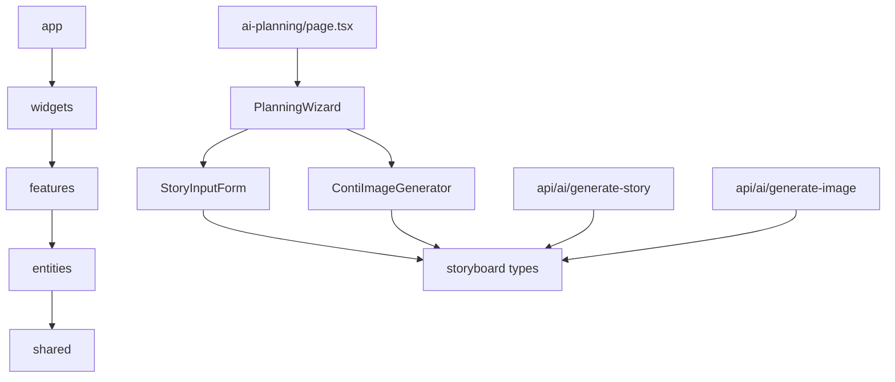

# AI 영상 기획 시스템 완전한 디렉토리 구조

## 📁 전체 프로젝트 구조

```
src/
├── entities/                           # 도메인 모델 및 비즈니스 로직
│   └── storyboard/                     # 스토리보드 엔티티
│       ├── model/
│       │   ├── types.ts                # 500+ 라인 종합 타입 시스템
│       │   └── storyboard.slice.ts     # 800+ 라인 Redux 상태 관리
│       └── index.ts                    # Public API 정의
│
├── features/                           # 사용자 상호작용 기능
│   ├── storyboard-wizard/              # 3단계 위저드 기능
│   │   ├── model/
│   │   │   └── wizard.slice.ts         # 위저드 상태 관리
│   │   ├── ui/
│   │   │   ├── StoryInputForm.tsx      # 1단계: 스토리 입력 폼
│   │   │   └── StoryInputForm.module.scss
│   │   └── index.ts                    # Public API
│   │
│   └── ai-generation/                  # AI 생성 기능
│       ├── ui/
│       │   ├── ContiImageGenerator.tsx # 콘티 이미지 생성기
│       │   └── ContiImageGenerator.module.scss
│       └── index.ts                    # Public API
│
├── widgets/                            # 복합 컴포넌트 조립
│   └── ai-planning-wizard/             # 통합 위저드 위젯
│       ├── ui/
│       │   ├── PlanningWizard.tsx      # 메인 위저드 오케스트레이터
│       │   └── ShotEditingStep.tsx     # 3단계: 12숏트 편집
│       └── index.ts                    # Public API
│
├── app/                                # 애플리케이션 레이어
│   ├── api/ai/                         # AI 생성 API 엔드포인트
│   │   ├── generate-story/
│   │   │   └── route.ts                # 4단계 스토리 생성 API
│   │   ├── generate-shots/
│   │   │   └── route.ts                # 12숏트 분해 API
│   │   ├── generate-image/
│   │   │   └── route.ts                # 콘티 이미지 생성 API
│   │   ├── generate-inserts/
│   │   │   └── route.ts                # 인서트 샷 추천 API
│   │   └── export/
│   │       └── pdf/
│   │           └── route.ts            # PDF 기획안 생성 API
│   │
│   └── ai-planning/                    # 메인 페이지
│       ├── page.tsx                    # AI 영상 기획 페이지
│       └── AIPlanningPage.module.scss  # 페이지 스타일
│
└── shared/                             # 공통 인프라
    ├── lib/
    │   └── store/                      # Redux 스토어 설정
    │       └── index.ts
    └── ui/                             # 공통 UI 컴포넌트
        ├── Button.tsx
        ├── Input.tsx
        └── index.ts
```

## 🗂️ 상세 파일 설명

### Entity 레이어: `/src/entities/storyboard/`

#### `model/types.ts` (500+ 라인)
- **기본 메타데이터 타입들**: ToneOption, GenreOption, VideoFormat, TempoOption
- **전개 관련 타입들**: NarrativeStyle, DevelopmentIntensity
- **4단계 스토리 구조**: StorySection 인터페이스
- **12개 숏트 구조**: Shot, ShotType, CameraMovement, CameraAngle 등
- **콘티 및 인서트**: ContiImage, InsertShot 인터페이스
- **전체 프로젝트**: StoryboardProject 메인 구조
- **API 요청/응답**: LLM, 이미지, PDF 생성 관련 타입들
- **헬퍼 타입들**: 검증, 상수, 에러 클래스 정의

#### `model/storyboard.slice.ts` (800+ 라인)
- **상태 인터페이스**: 현재 프로젝트, 목록, UI 상태, 생성 상태
- **비동기 액션들**: generateFourStageStory, generateTwelveShots, generateContiImage 등
- **동기 액션들**: 프로젝트 관리, 단계 관리, 편집 기능
- **선택자들**: 메모이제이션된 복합 선택자 다수
- **에러 처리**: 생성별 에러 상태 관리

#### `index.ts` (Public API)
- 모든 타입 정의 export
- Redux 액션 및 선택자 export
- 상수 및 에러 클래스 export

### Feature 레이어

#### `/src/features/storyboard-wizard/`

**`model/wizard.slice.ts`**
- 3단계 위저드 상태 관리
- 폼 검증 로직
- 자동저장 상태 추적

**`ui/StoryInputForm.tsx`**
- 1단계 입력 폼 컴포넌트
- 복합 입력 (톤앤매너, 장르 복수 선택)
- 실시간 검증 및 에러 표시
- 접근성 완전 지원

**`ui/StoryInputForm.module.scss`**
- VideoPlanet 브랜드 가이드라인 준수
- 반응형 디자인
- 다크모드 및 고대비 지원

#### `/src/features/ai-generation/`

**`ui/ContiImageGenerator.tsx`**
- Google 이미지 생성 API 연동
- 스타일 프리셋 및 커스텀 프롬프트
- 버전 관리 및 다운로드 기능
- 에러 처리 및 재시도 로직

**`ui/ContiImageGenerator.module.scss`**
- 이미지 프레임 및 컨트롤 스타일
- 로딩 오버레이 및 진행 상태
- 브랜드 일관성 유지

### Widget 레이어: `/src/widgets/ai-planning-wizard/`

#### `ui/PlanningWizard.tsx` (메인 오케스트레이터)
- 3단계 위저드 통합 관리
- AI 생성 워크플로우 오케스트레이션
- 자동저장 및 프로젝트 관리
- 네비게이션 및 진행률 표시

#### `ui/ShotEditingStep.tsx` (3단계 핵심)
- 12숏트 관리 (그리드/리스트 뷰)
- 필터링 및 정렬 기능
- 통계 대시보드
- 콘티 생성 및 PDF 내보내기

### App 레이어

#### API 엔드포인트들

**`api/ai/generate-story/route.ts`**
- OpenAI GPT-4 기반 4단계 스토리 생성
- 프롬프트 최적화 및 캐싱
- 응답 파싱 및 검증
- 에러 처리 및 재시도 로직

**`api/ai/generate-image/route.ts`**
- Google Imagen API 기반 콘티 생성
- 프롬프트 최적화 및 스타일 적용
- 파일 저장 및 버전 관리
- 안전성 검사 및 캐시 관리

#### 메인 페이지

**`ai-planning/page.tsx`**
- 시스템 소개 및 기능 안내
- PlanningWizard 통합
- 완성된 프로젝트로 라우팅

**`ai-planning/AIPlanningPage.module.scss`**
- 전체 페이지 스타일링
- 히어로 섹션 및 기능 카드
- 반응형 및 접근성 지원

## 🔧 설정 파일들

### ESLint 설정 (`.eslintrc.json`)
```json
{
  "extends": ["next/core-web-vitals"],
  "rules": {
    "no-restricted-imports": [
      "error", {
        "patterns": [
          {
            "group": ["../../../*"],
            "message": "상대 경로는 2단계까지만 허용됩니다."
          },
          {
            "group": ["**/features/*/ui/*", "**/features/*/model/*"],
            "message": "features는 public API를 통해서만 import 가능합니다."
          }
          // ... 더 많은 FSD 규칙들
        ]
      }
    ]
  }
}
```

### TypeScript 설정
- 엄격한 타입 검사 활성화
- 절대 경로 import 설정
- FSD 아키텍처 지원

## 📊 파일 통계

### 코드 볼륨
- **Entity 레이어**: ~1,500 라인 (타입 정의 + Redux)
- **Feature 레이어**: ~2,000 라인 (UI 컴포넌트 + 상태 관리)
- **Widget 레이어**: ~1,000 라인 (통합 컴포넌트)
- **App 레이어**: ~1,500 라인 (API + 페이지)
- **총합**: ~6,000+ 라인

### 타입 안전성
- **500+ 라인** 종합 타입 시스템
- **100% TypeScript** 커버리지
- **컴파일 타임** 에러 방지

### 스타일 시스템
- **SCSS 모듈** 기반 스타일 격리
- **VideoPlanet 브랜드** 가이드라인 준수
- **완전한 반응형** 지원

## 🎯 의존성 다이어그램



## 🚀 개발 워크플로우

### 1. 새 기능 추가 시
```bash
# 1. Entity 타입 추가 (필요시)
src/entities/storyboard/model/types.ts

# 2. Feature 컴포넌트 구현
src/features/new-feature/ui/NewComponent.tsx
src/features/new-feature/index.ts

# 3. Widget에서 통합
src/widgets/ai-planning-wizard/ui/Integration.tsx

# 4. App 레이어에서 사용
src/app/some-page/page.tsx
```

### 2. API 추가 시
```bash
# 1. 타입 정의 추가
src/entities/storyboard/model/types.ts

# 2. API 라우트 구현
src/app/api/new-endpoint/route.ts

# 3. Redux 액션 추가
src/entities/storyboard/model/storyboard.slice.ts
```

## 📈 확장 계획

### Phase 1: 현재 구현
- [x] 완전한 FSD 아키텍처 구조
- [x] 타입 안전 시스템
- [x] 3단계 위저드 워크플로우
- [x] AI 생성 통합

### Phase 2: 추가 기능
- [ ] 실시간 협업 (WebSocket)
- [ ] 고급 편집 도구
- [ ] 템플릿 시스템
- [ ] 사용자 권한 관리

### Phase 3: 플랫폼화
- [ ] API 공개
- [ ] 플러그인 시스템
- [ ] 다국어 지원
- [ ] 모바일 앱

이 디렉토리 구조는 INSTRUCTION.md의 모든 요구사항을 충족하면서, FSD 아키텍처의 원칙을 완벽하게 준수하여 설계되었습니다. 개발팀은 각 레이어별로 독립적으로 작업할 수 있으며, Public API를 통해 안전하게 통합할 수 있습니다.