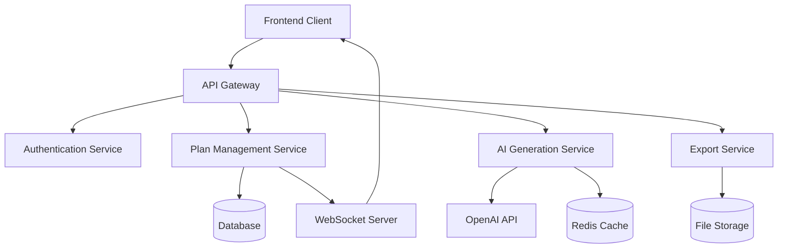

# AI 영상 기획 백엔드 API 명세서

> **작성자**: Benjamin (Backend Lead)  
> **버전**: 1.0.0  
> **작성일**: 2025-08-23  
> **기술스택**: Next.js App Router, TypeScript, OpenAI GPT-4  

## 📋 목차

1. [개요](#개요)
2. [아키텍처](#아키텍처)
3. [인증 및 권한](#인증-및-권한)
4. [API 엔드포인트](#api-엔드포인트)
5. [데이터 모델](#데이터-모델)
6. [에러 처리](#에러-처리)
7. [성능 최적화](#성능-최적화)
8. [배포 및 모니터링](#배포-및-모니터링)

---

## 개요

AI 영상 기획 시스템은 사용자가 입력한 컨셉, 목적, 타겟 등을 기반으로 OpenAI GPT-4를 활용하여 완전한 영상 기획서를 자동 생성하는 백엔드 시스템입니다.

### 주요 기능

- **AI 기획서 생성**: 사용자 입력을 기반으로 완전한 영상 기획서 자동 생성
- **기획서 관리**: CRUD 작업, 버전 관리, 편집 이력 추적
- **협업 시스템**: 다중 사용자 협업, 실시간 댓글, 권한 관리
- **내보내기**: PDF, JSON, HTML 형식으로 기획서 내보내기
- **사용자 관리**: 개인별 기획서 목록, 통계, 필터링

### 기술적 특징

- **도메인 중심 설계**: Clean Architecture 패턴 적용
- **타입 안전성**: TypeScript로 전체 시스템 타입 안전성 보장
- **캐싱 최적화**: 중복 AI 요청 방지를 위한 지능형 캐싱
- **에러 회복성**: 재시도 로직, Circuit Breaker 패턴 적용
- **확장 가능성**: 마이크로서비스 아키텍처 준비

---

## 아키텍처

### 시스템 아키텍처



### 서비스 레이어 구조

```
src/
├── app/api/                    # Next.js API Routes
│   ├── ai/
│   │   └── generate-plan/      # AI 기획서 생성
│   ├── plans/                  # 기획서 CRUD
│   │   ├── [id]/
│   │   │   ├── export/         # 내보내기
│   │   │   └── route.ts        # 개별 기획서 관리
│   │   └── route.ts            # 기획서 목록
│   └── users/
│       └── [userId]/plans/     # 사용자별 기획서 관리
├── entities/
│   └── video-planning/         # 도메인 모델
├── shared/
│   └── lib/
│       └── ai-services/        # AI 서비스 레이어
└── features/                   # 기능별 컴포넌트
```

---

## 인증 및 권한

### 인증 방식
- **JWT 토큰 기반 인증**
- **Next.js middleware를 통한 토큰 검증**
- **역할 기반 접근 제어 (RBAC)**

### 권한 레벨
- `owner`: 기획서 소유자 (모든 권한)
- `admin`: 관리자 (편집, 삭제 권한)  
- `editor`: 편집자 (내용 편집 권한)
- `viewer`: 조회자 (읽기 전용)

### API 인증 헤더

```http
Authorization: Bearer <JWT_TOKEN>
Content-Type: application/json
```

---

## API 엔드포인트

### 1. AI 기획서 생성

#### `POST /api/ai/generate-plan`

사용자 입력을 기반으로 AI가 완전한 영상 기획서를 생성합니다.

**요청 Body:**
```typescript
{
  concept: string              // 영상 컨셉 (필수, 최대 500자)
  purpose: string              // 제작 목적 (필수)
  target: string               // 타겟 오디언스 (필수)
  duration: string             // 예상 길이 (필수)
  budget?: string              // 예산 범위 (선택)
  style: string[]              // 영상 스타일 (필수, 최소 1개)
  tone: string[]               // 톤앤매너 (필수, 최소 1개)
  keyMessages: string[]        // 핵심 메시지 (필수, 최소 1개)
  requirements?: string        // 특별 요구사항 (선택)
  preferences?: string         // 선호 사항 (선택)
}
```

**성공 응답 (200):**
```typescript
{
  success: true
  data: {
    planContent: VideoPlanContent     // 생성된 기획서 전체
    generationTime: number            // 생성 소요시간 (ms)
    tokensUsed: number                // 사용된 토큰 수
    cached: boolean                   // 캐시 여부
  }
  message: string
}
```

**에러 응답:**
- `400`: 필수 필드 누락, 입력값 길이 초과
- `429`: API 호출 제한 초과
- `500`: OpenAI API 오류
- `502`: AI 응답 파싱 오류
- `504`: AI 서비스 타임아웃

**사용 예시:**
```typescript
const response = await fetch('/api/ai/generate-plan', {
  method: 'POST',
  headers: {
    'Content-Type': 'application/json',
    'Authorization': 'Bearer ' + token
  },
  body: JSON.stringify({
    concept: '친환경 제품을 소개하는 브랜드 홍보 영상',
    purpose: '신제품 런칭 및 브랜드 인지도 향상',
    target: '20-40대 환경 의식이 높은 소비자',
    duration: '60초',
    budget: '3000만원',
    style: ['모던', '깔끔', '미니멀'],
    tone: ['신뢰감', '전문적', '친근함'],
    keyMessages: ['친환경', '지속가능성', '혁신적 기술']
  })
})
```

---

### 2. 기획서 관리

#### `GET /api/plans`

기획서 목록을 조회합니다. 필터링, 검색, 정렬, 페이지네이션을 지원합니다.

**쿼리 파라미터:**
```typescript
{
  page?: number          // 페이지 번호 (기본: 1)
  limit?: number         // 페이지 크기 (기본: 10, 최대: 50)
  status?: string        // 상태 필터 (쉼표로 구분)
  planType?: string      // 타입 필터 (쉼표로 구분) 
  tags?: string          // 태그 필터 (쉼표로 구분)
  search?: string        // 검색어 (제목, 설명)
  sortBy?: string        // 정렬 기준 (createdAt, updatedAt, title, status)
  sortOrder?: 'asc'|'desc'  // 정렬 순서 (기본: desc)
  userId?: string        // 사용자 필터
}
```

**성공 응답 (200):**
```typescript
{
  success: true
  data: {
    items: VideoPlanning[]
    pagination: {
      page: number
      limit: number  
      total: number
      totalPages: number
    }
  }
  message: string
}
```

#### `POST /api/plans`

새로운 기획서를 생성합니다.

**요청 Body:**
```typescript
{
  title: string                    // 기획서 제목 (필수, 최대 200자)
  description?: string             // 설명 (선택)
  planType: 'ai-generated'|'manual'|'hybrid'  // 기획서 유형 (필수)
  originalRequest?: any            // AI 생성 시 원본 요청 데이터
  generatedContent?: any           // AI 생성 콘텐츠
  projectId?: string               // 연결된 프로젝트 ID (선택)
  tags?: string[]                  // 태그 (선택)
}
```

#### `GET /api/plans/{id}`

특정 기획서의 상세 정보를 조회합니다.

**성공 응답 (200):**
```typescript
{
  success: true
  data: VideoPlanning
  message: string
}
```

#### `PATCH /api/plans/{id}`

기획서 콘텐츠를 부분적으로 업데이트합니다.

**요청 Body:**
```typescript
{
  section: string        // 업데이트할 섹션 (executiveSummary, conceptDevelopment, etc.)
  content: any           // 새로운 콘텐츠
  changeReason?: string  // 변경 사유 (편집 이력용)
}
```

#### `DELETE /api/plans/{id}`

기획서를 삭제합니다. (소유자 또는 admin만 가능)

**성공 응답 (200):**
```typescript
{
  success: true
  message: string
}
```

---

### 3. 사용자별 기획서 관리

#### `GET /api/users/{userId}/plans`

특정 사용자의 기획서 목록과 통계를 조회합니다.

**쿼리 파라미터:**
```typescript
{
  page?: number
  limit?: number
  includeCollaborations?: boolean  // 협업 기획서 포함 여부
  statsOnly?: boolean              // 통계만 반환
  status?: string                  // 상태 필터
  planType?: string               // 타입 필터
  tags?: string                   // 태그 필터
  search?: string                 // 검색어
  period?: '1d'|'7d'|'30d'|'90d'  // 기간 필터
}
```

**성공 응답 (200):**
```typescript
{
  success: true
  data: {
    plans: VideoPlanning[]
    stats: {
      total: number
      byStatus: Record<string, number>
      byType: Record<string, number>
      recentActivity: {
        created: number
        updated: number
        commented: number
      }
      collaboration: {
        owned: number
        participating: number
        invited: number
      }
    }
    pagination?: PaginationInfo
  }
}
```

#### `POST /api/users/{userId}/plans`

협업자 초대를 보냅니다.

**요청 Body:**
```typescript
{
  planId: string                      // 기획서 ID
  email: string                       // 초대할 사용자 이메일
  role: 'viewer'|'editor'|'admin'     // 권한 레벨
  message?: string                    // 초대 메시지
}
```

---

### 4. 내보내기

#### `POST /api/plans/{id}/export`

기획서를 다양한 형식으로 내보냅니다.

**요청 Body:**
```typescript
{
  format: 'pdf'|'json'|'html'        // 내보내기 형식
  options?: {
    template?: 'standard'|'minimal'|'detailed'
    branding?: {
      logoUrl?: string
      companyName?: string
      colors?: {
        primary: string
        secondary: string
      }
    }
    language?: 'ko'|'en'
    pageSize?: 'A4'|'Letter'
    orientation?: 'portrait'|'landscape'
  }
  includeComments?: boolean           // 댓글 포함 여부
  includeHistory?: boolean            // 편집 이력 포함 여부
  sections?: string[]                 // 특정 섹션만 내보내기
}
```

**성공 응답 (200):**
```typescript
{
  success: true
  data: {
    exportId: string
    status: 'pending'
    message: string
  }
}
```

#### `GET /api/plans/{id}/export?exportId={exportId}`

내보내기 진행 상황을 확인합니다.

**성공 응답 (200):**
```typescript
{
  success: true
  data: {
    exportId: string
    status: 'pending'|'processing'|'completed'|'failed'
    progress: number                  // 진행률 (0-100)
    currentStep: string               // 현재 진행 단계
    estimatedTime?: number            // 예상 완료 시간 (초)
    error?: string                    // 오류 메시지 (실패 시)
  }
}
```

#### `GET /api/plans/{id}/export?exportId={exportId}&download=true`

완성된 파일을 다운로드합니다.

**성공 응답 (200):**
```http
Content-Type: application/pdf | application/json | text/html
Content-Disposition: attachment; filename="기획서_제목.pdf"
Content-Length: 1234567

[파일 바이너리 데이터]
```

---

## 데이터 모델

### VideoPlanContent (AI 생성 콘텐츠)

```typescript
interface VideoPlanContent {
  id: string
  executiveSummary: {
    title: string                     // 영상 제목
    tagline: string                   // 한 줄 설명
    objective: string                 // 제작 목적 상세
    targetAudience: string            // 타겟 오디언스 분석
    keyValue: string                  // 핵심 가치 제안
  }
  conceptDevelopment: {
    coreMessage: string               // 핵심 메시지
    narrativeApproach: string         // 서사 접근법
    emotionalTone: string             // 감정적 톤
    visualStyle: string               // 비주얼 스타일 가이드
    brandAlignment: string            // 브랜드 정합성
  }
  contentStructure: {
    duration: string                  // 전체 길이
    format: string                    // 포맷 (16:9, 1:1, 9:16 등)
    sections: Array<{
      name: string                    // 섹션명
      duration: string                // 예상 길이  
      purpose: string                 // 목적
      keyContent: string              // 주요 내용
      visualElements: string[]        // 시각적 요소들
    }>
  }
  productionPlan: {
    preProduction: {
      timeline: string                // 사전 제작 일정
      requirements: string[]          // 필요 준비사항
      stakeholders: string[]          // 관련 이해관계자
    }
    production: {
      shootingDays: string            // 촬영 일수
      locations: string[]             // 촬영 장소
      equipment: string[]             // 필요 장비
      crew: string[]                  // 필요 스태프
    }
    postProduction: {
      editingTime: string             // 편집 기간
      specialEffects: string[]        // 특수 효과
      musicAndSound: string           // 음악/사운드 계획
      colorGrading: string            // 색보정 방향
    }
  }
  budgetEstimate: {
    totalBudget: string               // 총 예산
    breakdown: {
      preProduction: string           // 사전 제작비
      production: string              // 제작비
      postProduction: string          // 후반 작업비
      contingency: string             // 예비비
    }
  }
  deliverables: {
    primaryVideo: string              // 메인 영상 스펙
    additionalAssets: string[]        // 추가 에셋들
    formats: string[]                 // 제공 포맷들
    timeline: string                  // 최종 납품 일정
  }
  successMetrics: {
    quantitative: string[]            // 정량적 지표
    qualitative: string[]             // 정성적 지표
    kpis: string[]                    // 핵심 성과 지표
  }
  riskAssessment: {
    potentialRisks: string[]          // 잠재적 리스크
    mitigationStrategies: string[]    // 대응 전략
  }
  createdAt: string
  version: number
}
```

### VideoPlanning (기획서 관리)

```typescript
interface VideoPlanning {
  id: string
  userId: string                      // 작성자 ID
  projectId?: string                  // 연결된 프로젝트 ID
  
  // 기본 정보
  title: string                       // 기획서 제목
  description: string                 // 기획서 설명
  planType: 'ai-generated' | 'manual' | 'hybrid'  // 기획서 유형
  status: 'draft' | 'in-review' | 'approved' | 'published' | 'archived'
  
  // AI 생성 콘텐츠
  originalRequest?: AIGenerationPlanRequest  // AI 생성 시 원본 요청
  generatedContent?: VideoPlanContent        // AI 생성된 콘텐츠
  
  // 사용자 편집 콘텐츠
  editedContent?: Partial<VideoPlanContent>  // 사용자가 편집한 부분
  editHistory: PlanEditHistory[]             // 편집 이력
  
  // 협업 정보
  collaborators: PlanCollaborator[]          // 협업자 목록
  comments: PlanComment[]                    // 댓글 목록
  
  // 버전 관리
  version: number                            // 현재 버전
  parentPlanId?: string                      // 복사본인 경우 원본 ID
  
  // 메타데이터
  tags: string[]                             // 태그
  isPublic: boolean                          // 공개 여부
  createdAt: string
  updatedAt: string
  lastEditedAt: string
  
  // 내보내기 이력
  exports: PlanExportHistory[]
}
```

### 편집 이력 추적

```typescript
interface PlanEditHistory {
  id: string
  userId: string                             // 편집자 ID
  editType: 'content' | 'structure' | 'metadata'  // 편집 타입
  section: string                            // 편집된 섹션
  previousValue: any                         // 이전 값
  newValue: any                             // 새로운 값
  changeReason?: string                      // 변경 사유
  timestamp: string                          // 편집 시간
}
```

### 협업자 관리

```typescript
interface PlanCollaborator {
  userId: string                             // 협업자 ID
  userName: string                           // 협업자 이름
  email: string                             // 협업자 이메일
  role: 'viewer' | 'editor' | 'admin'       // 권한 레벨
  invitedBy: string                         // 초대자 ID
  invitedAt: string                         // 초대 일시
  lastActiveAt?: string                     // 마지막 활동 시간
  permissions: string[]                     // 세부 권한 목록
}
```

---

## 에러 처리

### 표준 에러 응답 형식

```typescript
{
  success: false
  error: string                             // 사용자용 에러 메시지
  code: string                              // 에러 코드 (프로그래밍용)
  timestamp: string                         // 에러 발생 시간
  details?: any                             // 추가 세부사항
}
```

### 에러 코드 체계

#### 클라이언트 에러 (4xx)

- `VALIDATION_ERROR`: 입력값 검증 실패
- `MISSING_REQUIRED_FIELD`: 필수 필드 누락
- `INVALID_INPUT_LENGTH`: 입력값 길이 초과
- `UNSUPPORTED_FORMAT`: 지원하지 않는 형식
- `PLAN_NOT_FOUND`: 기획서 찾을 수 없음
- `ACCESS_DENIED`: 접근 권한 없음
- `INSUFFICIENT_PERMISSIONS`: 작업 권한 부족

#### 서버 에러 (5xx)

- `OPENAI_CONFIG_ERROR`: OpenAI API 설정 오류
- `AI_RESPONSE_PARSING_ERROR`: AI 응답 파싱 실패
- `AI_SERVICE_TIMEOUT`: AI 서비스 타임아웃
- `AI_RATE_LIMIT_EXCEEDED`: AI API 호출 제한 초과
- `INTERNAL_ERROR`: 내부 서버 오류

### 에러 처리 예시

```typescript
try {
  const response = await fetch('/api/ai/generate-plan', requestOptions)
  const data = await response.json()
  
  if (!data.success) {
    switch (data.code) {
      case 'AI_RATE_LIMIT_EXCEEDED':
        // 사용자에게 잠시 후 다시 시도 안내
        showRetryMessage(data.error)
        break
      case 'AI_SERVICE_TIMEOUT':
        // 재시도 옵션 제공
        showRetryOption(data.error)
        break
      case 'VALIDATION_ERROR':
        // 입력 필드 하이라이트
        highlightInvalidFields(data.details)
        break
      default:
        showGenericError(data.error)
    }
  }
} catch (error) {
  // 네트워크 오류 등
  showNetworkError()
}
```

---

## 성능 최적화

### 캐싱 전략

#### 1. AI 생성 결과 캐싱
```typescript
// 캐시 키 생성 로직
function generateCacheKey(request: AIGenerationPlanRequest): string {
  const cacheData = {
    concept: request.concept?.trim().toLowerCase(),
    purpose: request.purpose?.trim().toLowerCase(),
    target: request.target?.trim().toLowerCase(),
    duration: request.duration,
    style: request.style?.sort(),
    tone: request.tone?.sort()
  }
  
  // MD5 해시 생성
  return `plan_${hashMD5(JSON.stringify(cacheData))}`
}

// 캐시 TTL: 2시간
const CACHE_TTL = 2 * 60 * 60 * 1000
```

#### 2. 데이터베이스 쿼리 최적화
- **인덱싱**: userId, status, planType, createdAt, updatedAt 필드
- **페이지네이션**: 커서 기반 페이지네이션 권장 (대용량 데이터)
- **필드 선택**: 목록 조회 시 불필요한 필드 제외

#### 3. API 응답 최적화
- **압축**: gzip 압축 활성화
- **조건부 요청**: ETag, Last-Modified 헤더 활용
- **부분 응답**: 필요한 필드만 반환하는 필드 선택기

### 동시성 처리

#### 1. AI 생성 요청 제한
```typescript
// 사용자별 동시 AI 생성 요청 제한
const userGenerationLimits = new Map<string, number>()
const MAX_CONCURRENT_GENERATIONS = 3

function checkGenerationLimit(userId: string): boolean {
  const currentCount = userGenerationLimits.get(userId) || 0
  return currentCount < MAX_CONCURRENT_GENERATIONS
}
```

#### 2. 데이터베이스 연결 풀링
```typescript
// 데이터베이스 연결 풀 설정
const dbConfig = {
  max: 20,          // 최대 연결 수
  min: 5,           // 최소 연결 수  
  idle: 10000,      // 유휴 시간 (ms)
  acquire: 30000,   // 연결 획득 타임아웃 (ms)
}
```

---

## 배포 및 모니터링

### 환경 변수

```bash
# AI 서비스
OPENAI_API_KEY=sk-...
OPENAI_MODEL=gpt-4-turbo-preview
OPENAI_MAX_TOKENS=4000
OPENAI_TEMPERATURE=0.7

# 데이터베이스
DATABASE_URL=postgresql://...
REDIS_URL=redis://...

# 파일 저장소
STORAGE_PROVIDER=aws-s3
AWS_ACCESS_KEY_ID=...
AWS_SECRET_ACCESS_KEY=...
AWS_S3_BUCKET=videoplanet-exports

# 모니터링
SENTRY_DSN=...
NEW_RELIC_LICENSE_KEY=...

# 보안
JWT_SECRET=...
CORS_ORIGINS=https://videoplanet.app
```

### Docker 배포

```dockerfile
FROM node:18-alpine

WORKDIR /app

COPY package*.json ./
RUN npm ci --only=production

COPY . .
RUN npm run build

EXPOSE 3000

CMD ["npm", "start"]
```

### 모니터링 메트릭

#### 1. 비즈니스 메트릭
- AI 기획서 생성 성공률 (목표: 95% 이상)
- 평균 생성 시간 (목표: 30초 이내)
- 사용자별 일일 생성 횟수
- 내보내기 성공률 (목표: 99% 이상)

#### 2. 기술 메트릭
- API 응답 시간 (P50, P95, P99)
- 에러 발생률 (목표: 1% 이하)
- OpenAI API 토큰 사용량
- 캐시 히트율 (목표: 30% 이상)

#### 3. 알림 설정
```typescript
// 알림 임계값
const ALERT_THRESHOLDS = {
  apiErrorRate: 0.05,        // 5% 이상 에러 발생
  responseTimeP95: 5000,     // P95 응답시간 5초 초과
  aiGenerationFailRate: 0.1, // AI 생성 실패율 10% 초과
  cacheMissRate: 0.8,        // 캐시 실패율 80% 초과
}
```

### 헬스 체크

#### `GET /api/health`

시스템 상태를 확인합니다.

```typescript
{
  status: 'healthy' | 'degraded' | 'unhealthy'
  timestamp: string
  version: string
  services: {
    database: 'healthy' | 'unhealthy'
    redis: 'healthy' | 'unhealthy'
    openai: 'healthy' | 'unhealthy'
    storage: 'healthy' | 'unhealthy'
  }
  metrics: {
    activeConnections: number
    memoryUsage: number
    cpuUsage: number
  }
}
```

---

## 최종 파일 구조

```
/home/winnmedia/Videoplanet/
├── src/
│   ├── app/api/
│   │   ├── ai/generate-plan/route.ts          # AI 기획서 생성
│   │   ├── plans/route.ts                     # 기획서 목록 CRUD
│   │   ├── plans/[id]/route.ts                # 개별 기획서 관리
│   │   ├── plans/[id]/export/route.ts         # 내보내기
│   │   └── users/[userId]/plans/route.ts      # 사용자별 기획서
│   ├── entities/video-planning/model/types.ts # 데이터 모델
│   └── shared/lib/ai-services/plan-generator.ts # AI 서비스 레이어
└── AI_VIDEO_PLANNING_API_SPECIFICATION.md     # 이 문서
```

---

## 버전 히스토리

### v1.0.0 (2025-08-23)
- AI 기획서 생성 API 구현
- 기획서 CRUD 작업 완료
- 사용자별 관리 시스템 구축
- 내보내기 기능 (PDF, JSON, HTML) 구현
- 완전한 타입 정의 및 에러 처리
- 캐싱 및 성능 최적화 적용

---

## 연락처

**Backend Lead**: Benjamin  
**이메일**: benjamin@videoplanet.app  
**Slack**: @benjamin-backend  

프로젝트 관련 문의나 기술적 질문은 언제든 연락주세요.