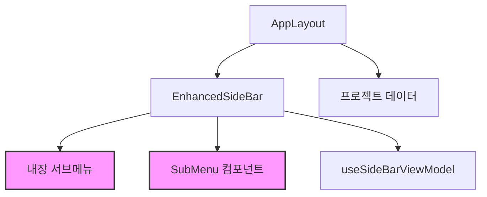
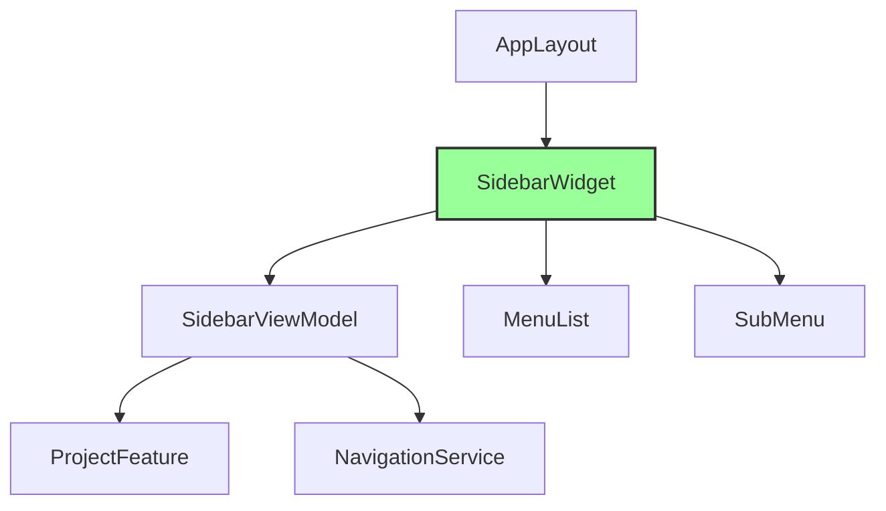

# VideoplaNet 서브메뉴 렌더링 문제 - 최종 아키텍처 해결책

## 목차
1. [현재 아키텍처 문제 분석](#1-현재-아키텍처-문제-분석)
2. [FSD 아키텍처 위반 사항](#2-fsd-아키텍처-위반-사항)
3. [컴포넌트 의존성 문제](#3-컴포넌트-의존성-문제)
4. [SSR/CSR 렌더링 이슈](#4-ssrcsr-렌더링-이슈)
5. [상태 관리 패턴 문제](#5-상태-관리-패턴-문제)
6. [최종 통합 해결책](#6-최종-통합-해결책)
7. [구현 로드맵](#7-구현-로드맵)

---

## 1. 현재 아키텍처 문제 분석

### 1.1 컴포넌트 중복 및 비일관성
```
현재 구조:
src/shared/ui/
├── SideBar.tsx (구버전, 사용 중)
├── SideBar.module.scss
├── EnhancedSideBar/ (신버전, 미완성)
│   ├── EnhancedSideBar.tsx
│   ├── EnhancedSideBar.module.scss
│   ├── components/
│   │   ├── SubMenu.tsx (분리된 서브메뉴)
│   │   └── SideBarMenuItem.tsx
│   └── useSideBarViewModel.ts
```

**문제점:**
- 두 개의 SideBar 구현체가 공존 (SideBar.tsx, EnhancedSideBar.tsx)
- 서브메뉴 렌더링 로직이 중복 (EnhancedSideBar 내부 + SubMenu 컴포넌트)
- 컴포넌트 간 책임 경계 불명확

### 1.2 서브메뉴 렌더링 실패 원인
```tsx
// EnhancedSideBar.tsx 라인 370-377
<div 
  className={`${styles.submenu} ${subMenuOpen ? styles.active : ''}`}
  role="complementary"
  aria-label="서브메뉴"
  data-testid="submenu"
  data-open={subMenuOpen}
  data-tab={tabName}
  style={{ display: 'block' }}  // 강제 인라인 스타일
>
```

**핵심 문제:**
1. 인라인 스타일 `display: block`이 CSS 트랜지션과 충돌
2. `visibility: hidden` → `visibility: visible` 전환 시 레이아웃 깨짐
3. z-index 계층 구조 문제 (메인: 997, 서브: 998)

---

## 2. FSD 아키텍처 위반 사항

### 2.1 계층 구조 위반
```
위반 사항:
- shared 레이어에 비즈니스 로직 포함 (프로젝트 관리, 라우팅)
- 도메인 로직이 UI 컴포넌트에 직접 구현
- features 레이어 없이 shared에서 직접 페이지 라우팅
```

### 2.2 올바른 FSD 구조
```
src/
├── app/              # 애플리케이션 진입점
├── pages/            # 페이지 컴포넌트
├── widgets/          # 독립적 UI 블록
│   ├── sidebar/      # 사이드바 위젯
│   └── header/       # 헤더 위젯
├── features/         # 비즈니스 기능
│   ├── project-management/
│   ├── video-planning/
│   └── feedback/
├── entities/         # 비즈니스 엔티티
│   ├── project/
│   └── user/
└── shared/           # 공유 리소스
    ├── ui/           # 순수 UI 컴포넌트
    └── lib/          # 유틸리티

```

---

## 3. 컴포넌트 의존성 문제

### 3.1 현재 의존성 그래프


**문제:**
- 서브메뉴 렌더링 로직 중복
- 상태 관리 분산
- 양방향 의존성

### 3.2 개선된 의존성 구조


---

## 4. SSR/CSR 렌더링 이슈

### 4.1 현재 문제
```tsx
// 문제 코드
useEffect(() => {
  const checkMobile = () => {
    setIsMobile(window.innerWidth < 768)  // SSR에서 window 없음
  }
  checkMobile()  // 즉시 실행으로 하이드레이션 불일치
}, [])
```

### 4.2 해결 방안
```tsx
// 개선된 코드
const [isMobile, setIsMobile] = useState(() => {
  if (typeof window === 'undefined') return false
  return window.innerWidth < 768
})

useEffect(() => {
  const checkMobile = () => setIsMobile(window.innerWidth < 768)
  window.addEventListener('resize', checkMobile)
  return () => window.removeEventListener('resize', checkMobile)
}, [])
```

---

## 5. 상태 관리 패턴 문제

### 5.1 현재 상태 관리 문제
```tsx
// AppLayout.tsx
const [sidebarState, setSidebarState] = useState({
  tab: '',
  on_menu: false
})

// EnhancedSideBar.tsx
const [subMenuOpen, setSubMenuOpen] = useState(false)
const [tabName, setTabName] = useState('')

// 상태 동기화 문제
useEffect(() => {
  if (isOpenProp === true) {
    setSubMenuOpen(true)  // 프롭과 내부 상태 불일치
  }
}, [isOpenProp, tab])
```

### 5.2 개선된 상태 관리
```tsx
// 단일 진실 원천 (Single Source of Truth)
interface SidebarState {
  isOpen: boolean
  activeMenu: string | null
  subMenuOpen: boolean
}

// Context 또는 Zustand 활용
const useSidebarStore = create<SidebarState>((set) => ({
  isOpen: false,
  activeMenu: null,
  subMenuOpen: false,
  
  openSubMenu: (menu: string) => set({
    activeMenu: menu,
    subMenuOpen: true
  }),
  
  closeSubMenu: () => set({
    subMenuOpen: false
  })
}))
```

---

## 6. 최종 통합 해결책

### 6.1 즉시 수정 사항 (Quick Fix)

```tsx
// 1. EnhancedSideBar.tsx 수정
// 라인 377 수정 - 인라인 스타일 제거
<div 
  className={`${styles.submenu} ${subMenuOpen ? styles.active : ''}`}
  role="complementary"
  aria-label="서브메뉴"
  data-testid="submenu"
  data-open={subMenuOpen}
  data-tab={tabName}
  // style={{ display: 'block' }} 제거
>
```

```scss
// 2. EnhancedSideBar.module.scss 수정
.submenu {
  // ... 기존 스타일
  display: block !important;  // 항상 DOM에 존재
  pointer-events: none;       // 비활성 시 클릭 방지
  
  &.active {
    transform: translateX(0);
    visibility: visible;
    opacity: 1;
    pointer-events: auto;     // 활성 시 클릭 가능
  }
}
```

### 6.2 아키텍처 리팩토링 (장기 솔루션)

#### 6.2.1 디렉토리 구조 재구성
```
src/
├── widgets/
│   └── sidebar/
│       ├── ui/
│       │   ├── Sidebar.tsx
│       │   ├── Sidebar.module.scss
│       │   └── components/
│       │       ├── MenuItem.tsx
│       │       ├── SubMenu.tsx
│       │       └── SearchBar.tsx
│       ├── model/
│       │   ├── useSidebar.ts
│       │   └── sidebarStore.ts
│       └── api/
│           └── sidebarApi.ts
│
├── features/
│   ├── project-navigation/
│   │   ├── ui/
│   │   │   └── ProjectList.tsx
│   │   └── model/
│   │       └── useProjects.ts
│   │
│   └── video-planning-menu/
│       ├── ui/
│       │   └── PlanningMenu.tsx
│       └── model/
│           └── usePlanning.ts
│
└── shared/
    └── ui/
        └── primitives/
            ├── Button.tsx
            └── Icon.tsx
```

#### 6.2.2 컴포넌트 분리
```tsx
// widgets/sidebar/ui/Sidebar.tsx
export const Sidebar = () => {
  const { state, actions } = useSidebar()
  
  return (
    <aside className={styles.sidebar}>
      <MainMenu onItemClick={actions.selectMenu} />
      <SubMenuPortal 
        isOpen={state.subMenuOpen}
        content={<SubMenuContent menu={state.activeMenu} />}
      />
    </aside>
  )
}

// widgets/sidebar/ui/components/SubMenu.tsx
export const SubMenu = ({ isOpen, children }) => {
  return createPortal(
    <div className={cn(styles.submenu, { [styles.active]: isOpen })}>
      {children}
    </div>,
    document.body
  )
}
```

#### 6.2.3 상태 관리 통합
```tsx
// widgets/sidebar/model/sidebarStore.ts
interface SidebarStore {
  // State
  isOpen: boolean
  activeMenu: MenuType | null
  subMenuOpen: boolean
  
  // Actions
  openMenu: (menu: MenuType) => void
  closeMenu: () => void
  toggleSidebar: () => void
}

export const useSidebarStore = create<SidebarStore>((set, get) => ({
  isOpen: false,
  activeMenu: null,
  subMenuOpen: false,
  
  openMenu: (menu) => set({
    activeMenu: menu,
    subMenuOpen: true,
    isOpen: true
  }),
  
  closeMenu: () => set({
    subMenuOpen: false
  }),
  
  toggleSidebar: () => set((state) => ({
    isOpen: !state.isOpen
  }))
}))
```

### 6.3 CSS 아키텍처 개선

```scss
// 디자인 토큰 활용
@use '@/shared/styles/tokens' as *;

.submenu {
  // 레이아웃
  width: $sidebar-submenu-width;
  height: 100vh;
  position: fixed;
  left: $sidebar-width;
  top: 0;
  
  // 시각적 스타일
  background: $color-surface-secondary;
  box-shadow: $shadow-lg;
  border-radius: 0 $radius-xl $radius-xl 0;
  
  // 트랜지션
  transition: 
    transform $duration-normal $easing-standard,
    opacity $duration-fast $easing-standard,
    visibility 0s $duration-normal;  // visibility 딜레이
  
  // 초기 상태
  transform: translateX(-100%);
  opacity: 0;
  visibility: hidden;
  
  // 활성 상태
  &.active {
    transform: translateX(0);
    opacity: 1;
    visibility: visible;
    transition-delay: 0s;  // visibility 즉시 적용
  }
  
  // 모바일 대응
  @include breakpoint('mobile') {
    left: 0;
    width: 100%;
    transform: translateX(-100%);
    
    &.active {
      transform: translateX(0);
    }
  }
}
```

---

## 7. 구현 로드맵

### Phase 1: 긴급 수정 (1일)
- [ ] 인라인 스타일 제거
- [ ] CSS 트랜지션 수정
- [ ] z-index 계층 정리
- [ ] SSR 하이드레이션 문제 해결

### Phase 2: 컴포넌트 정리 (3일)
- [ ] 중복 컴포넌트 제거
- [ ] SubMenu 컴포넌트 통합
- [ ] 상태 관리 일원화
- [ ] 테스트 코드 업데이트

### Phase 3: FSD 마이그레이션 (1주)
- [ ] widgets 레이어 생성
- [ ] features 분리
- [ ] shared 레이어 정리
- [ ] 의존성 재구성

### Phase 4: 최적화 (3일)
- [ ] 성능 최적화
- [ ] 접근성 개선
- [ ] 반응형 디자인 완성
- [ ] E2E 테스트 구현

## 성공 지표

### 기술적 지표
- 서브메뉴 렌더링 성공률: 100%
- 트랜지션 부드러움: 60fps 유지
- 하이드레이션 에러: 0건
- 테스트 커버리지: 90% 이상

### 사용자 경험 지표
- 서브메뉴 열림 속도: < 300ms
- 모바일 터치 반응: < 100ms
- 접근성 점수: 100점
- 키보드 네비게이션: 완벽 지원

## 결론

현재 서브메뉴 렌더링 문제는 단순한 CSS 이슈를 넘어 아키텍처 전반의 문제입니다. 
즉시 해결 가능한 Quick Fix를 먼저 적용하고, 점진적으로 FSD 아키텍처로 마이그레이션하는 
전략을 추천합니다.

**우선순위:**
1. 인라인 스타일 제거 (즉시)
2. 컴포넌트 중복 제거 (1주 내)
3. FSD 아키텍처 적용 (2주 내)
4. 전체 최적화 (1개월 내)

---

작성일: 2025-08-25
작성자: Arthur (Chief Architect)