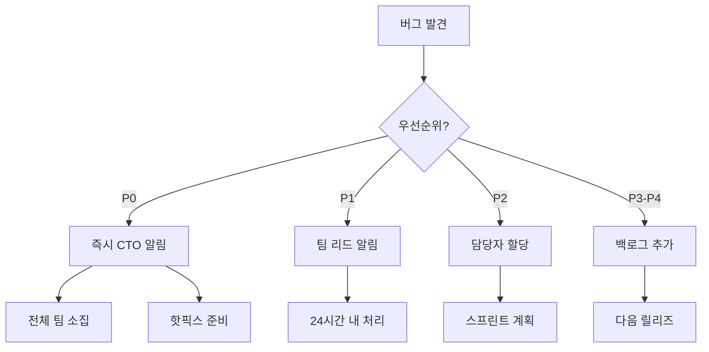

# 버그 우선순위 매트릭스
## VideoPlanet 결함 분류 및 처리 가이드

---

## 🎯 버그 분류 체계

### 심각도 (Severity) × 발생빈도 (Frequency) × 영향범위 (Impact) = 우선순위

```
우선순위 점수 = (심각도 × 4) + (발생빈도 × 3) + (영향범위 × 3)

P0 (Blocker): 36-40점
P1 (Critical): 28-35점
P2 (Major): 20-27점
P3 (Minor): 12-19점
P4 (Trivial): 0-11점
```

---

## 📊 심각도 레벨 정의

### S0: Blocker (차단)
**점수**: 10점  
**정의**: 서비스 전체 또는 핵심 기능이 완전히 작동 불가

| 예시 | SLA | 에스컬레이션 |
|------|-----|-------------|
| 로그인 시스템 전체 다운 | 30분 내 | 즉시 CTO |
| 결제 시스템 장애 | 30분 내 | 즉시 CTO |
| 데이터 손실 발생 | 즉시 | CEO/CTO |
| 보안 침해 발생 | 즉시 | 전체 알림 |

### S1: Critical (치명적)
**점수**: 8점  
**정의**: 주요 기능 사용 불가, 우회 방법 없음

| 예시 | SLA | 에스컬레이션 |
|------|-----|-------------|
| AI 기획 생성 실패 | 2시간 내 | 팀 리드 |
| 비디오 업로드 불가 | 2시간 내 | 팀 리드 |
| 피드백 제출 실패 | 4시간 내 | 팀 리드 |
| 프로젝트 생성 불가 | 4시간 내 | PM |

### S2: Major (주요)
**점수**: 6점  
**정의**: 기능 제한적 작동, 우회 방법 존재

| 예시 | SLA | 에스컬레이션 |
|------|-----|-------------|
| 특정 브라우저 오류 | 1일 내 | 담당자 |
| PDF 다운로드 실패 | 1일 내 | 담당자 |
| 알림 지연 | 2일 내 | 담당자 |
| 검색 기능 부정확 | 3일 내 | 담당자 |

### S3: Minor (경미)
**점수**: 3점  
**정의**: 사용 가능하나 불편함

| 예시 | SLA | 에스컬레이션 |
|------|-----|-------------|
| UI 레이아웃 깨짐 | 1주 내 | 없음 |
| 툴팁 표시 오류 | 1주 내 | 없음 |
| 페이지네이션 오류 | 2주 내 | 없음 |
| 정렬 기능 오류 | 2주 내 | 없음 |

### S4: Trivial (사소)
**점수**: 1점  
**정의**: 미미한 영향

| 예시 | SLA | 에스컬레이션 |
|------|-----|-------------|
| 오타 | 다음 릴리즈 | 없음 |
| 색상 불일치 | 다음 릴리즈 | 없음 |
| 아이콘 누락 | 다음 릴리즈 | 없음 |
| 텍스트 정렬 | 다음 릴리즈 | 없음 |

---

## 📈 발생빈도 분류

### 빈도 레벨
| 레벨 | 정의 | 점수 | 기준 |
|------|------|------|------|
| **Always** | 항상 발생 | 10 | 100% 재현 |
| **Often** | 자주 발생 | 7 | 70% 이상 |
| **Sometimes** | 가끔 발생 | 4 | 30-70% |
| **Rarely** | 드물게 발생 | 2 | 30% 미만 |

---

## 🌐 영향범위 분류

### 영향 레벨
| 레벨 | 정의 | 점수 | 영향 사용자 |
|------|------|------|------------|
| **All Users** | 전체 사용자 | 10 | 100% |
| **Most Users** | 대부분 사용자 | 7 | 50% 이상 |
| **Some Users** | 일부 사용자 | 4 | 10-50% |
| **Few Users** | 소수 사용자 | 2 | 10% 미만 |

---

## 🔢 우선순위 계산 예시

### 케이스 1: 로그인 실패
- **심각도**: S0 (10점) × 4 = 40
- **빈도**: Always (10점) × 3 = 30
- **영향**: All Users (10점) × 3 = 30
- **총점**: 100점 → **P0 (즉시 처리)**

### 케이스 2: 특정 브라우저 UI 깨짐
- **심각도**: S3 (3점) × 4 = 12
- **빈도**: Sometimes (4점) × 3 = 12
- **영향**: Some Users (4점) × 3 = 12
- **총점**: 36점 → **P2 (일반 처리)**

### 케이스 3: 오타
- **심각도**: S4 (1점) × 4 = 4
- **빈도**: Always (10점) × 3 = 30
- **영향**: Few Users (2점) × 3 = 6
- **총점**: 40점 → **P3 (낮은 우선순위)**

---

## 🚨 비즈니스 임팩트 매트릭스

```
        높은 비즈니스 임팩트
                ↑
    P0 │ P0 │ P1 │ P1
    ───┼────┼────┼────
    P0 │ P1 │ P1 │ P2
    ───┼────┼────┼────
    P1 │ P1 │ P2 │ P3
    ───┼────┼────┼────
    P2 │ P3 │ P3 │ P4
                →
        높은 기술적 복잡도
```

### 비즈니스 임팩트 요소
1. **매출 직접 영향**: 결제, 구독, 라이선스
2. **고객 이탈 위험**: 핵심 기능 장애
3. **브랜드 이미지**: 공개적 오류, 데이터 유출
4. **법적 컴플라이언스**: 개인정보, 보안
5. **경쟁 우위**: 차별화 기능

---

## 📋 버그 처리 프로세스

### 1. 버그 발견 및 보고
```markdown
## 버그 리포트 템플릿

### 제목
[심각도] 간단명료한 버그 설명

### 환경
- 브라우저: Chrome 120
- OS: Windows 11
- 사용자 역할: Editor
- 발생 시간: 2025-01-27 14:30

### 재현 단계
1. 로그인 후 대시보드 접속
2. 프로젝트 생성 버튼 클릭
3. 필수 정보 입력 후 저장

### 예상 동작
프로젝트가 생성되고 목록에 표시

### 실제 동작
500 에러 발생, 프로젝트 생성 실패

### 스크린샷/로그
[첨부]

### 우회 방법
현재 없음
```

### 2. 트리아지 (Triage)
```typescript
interface BugTriage {
  id: string;
  severity: 'S0' | 'S1' | 'S2' | 'S3' | 'S4';
  frequency: 'Always' | 'Often' | 'Sometimes' | 'Rarely';
  impact: 'All' | 'Most' | 'Some' | 'Few';
  priority: 'P0' | 'P1' | 'P2' | 'P3' | 'P4';
  assignee: string;
  dueDate: Date;
  status: 'New' | 'Triaged' | 'In Progress' | 'Fixed' | 'Verified';
}

function calculatePriority(bug: Bug): Priority {
  const severityScore = getSeverityScore(bug.severity) * 4;
  const frequencyScore = getFrequencyScore(bug.frequency) * 3;
  const impactScore = getImpactScore(bug.impact) * 3;
  
  const totalScore = severityScore + frequencyScore + impactScore;
  
  if (totalScore >= 36) return 'P0';
  if (totalScore >= 28) return 'P1';
  if (totalScore >= 20) return 'P2';
  if (totalScore >= 12) return 'P3';
  return 'P4';
}
```

### 3. 할당 및 추적
```yaml
# JIRA/GitHub Issues 자동화
name: Bug Assignment

on:
  issues:
    types: [labeled]

jobs:
  assign:
    if: contains(github.event.label.name, 'bug-P')
    runs-on: ubuntu-latest
    steps:
      - name: Auto-assign based on priority
        uses: actions/github-script@v7
        with:
          script: |
            const priority = context.payload.label.name;
            let assignee;
            
            switch(priority) {
              case 'bug-P0':
                assignee = 'senior-dev-1';
                break;
              case 'bug-P1':
                assignee = 'senior-dev-2';
                break;
              case 'bug-P2':
                assignee = 'mid-dev-1';
                break;
              default:
                assignee = 'junior-dev-1';
            }
            
            await github.rest.issues.addAssignees({
              owner: context.repo.owner,
              repo: context.repo.repo,
              issue_number: context.issue.number,
              assignees: [assignee]
            });
```

### 4. 수정 및 검증
```typescript
// 버그 수정 워크플로우
class BugFixWorkflow {
  async fix(bugId: string) {
    // 1. 재현 테스트 작성
    await this.writeReproductionTest(bugId);
    
    // 2. 수정 구현
    await this.implementFix(bugId);
    
    // 3. 테스트 통과 확인
    await this.runTests();
    
    // 4. 회귀 테스트
    await this.runRegressionTests();
    
    // 5. PR 생성
    await this.createPullRequest(bugId);
    
    // 6. 리뷰 요청
    await this.requestReview();
  }
  
  async verify(bugId: string) {
    // 1. 수정 확인
    const isFixed = await this.checkFix(bugId);
    
    // 2. 사이드 이펙트 검사
    const hasSideEffects = await this.checkSideEffects();
    
    // 3. 성능 영향 평가
    const performanceImpact = await this.measurePerformance();
    
    return {
      verified: isFixed && !hasSideEffects,
      performanceImpact
    };
  }
}
```

---

## 📊 버그 메트릭 및 KPI

### 주요 지표
```typescript
interface BugMetrics {
  // 발견 지표
  totalBugs: number;
  newBugsThisWeek: number;
  bugsPerRelease: number;
  
  // 해결 지표
  fixedBugs: number;
  averageFixTime: {
    P0: number; // hours
    P1: number; // hours
    P2: number; // days
    P3: number; // days
  };
  
  // 품질 지표
  escapedDefects: number; // 프로덕션 발견
  regressionRate: number; // 재발생률
  customerReportedBugs: number;
  
  // 효율성 지표
  bugBacklog: number;
  reopenedBugs: number;
  verificationTime: number;
}
```

### 대시보드 예시
```javascript
// 버그 트렌드 차트
const bugTrend = {
  labels: ['Week 1', 'Week 2', 'Week 3', 'Week 4'],
  datasets: [
    {
      label: 'New Bugs',
      data: [23, 19, 15, 12],
      borderColor: 'red'
    },
    {
      label: 'Fixed Bugs',
      data: [18, 22, 20, 25],
      borderColor: 'green'
    },
    {
      label: 'Backlog',
      data: [45, 42, 37, 24],
      borderColor: 'orange'
    }
  ]
};

// 우선순위별 분포
const priorityDistribution = {
  P0: 2,  // 5%
  P1: 5,  // 12%
  P2: 12, // 29%
  P3: 18, // 43%
  P4: 5   // 12%
};
```

---

## 🔄 에스컬레이션 매트릭스

### 에스컬레이션 경로


### 에스컬레이션 타이밍
| 우선순위 | 초기 응답 | 1차 에스컬레이션 | 2차 에스컬레이션 |
|---------|----------|----------------|----------------|
| P0 | 즉시 | 30분 후 | 1시간 후 |
| P1 | 1시간 내 | 4시간 후 | 8시간 후 |
| P2 | 4시간 내 | 1일 후 | 3일 후 |
| P3 | 1일 내 | 1주 후 | 2주 후 |
| P4 | 1주 내 | - | - |

---

## 📱 알림 및 커뮤니케이션

### 알림 채널
```yaml
notifications:
  P0:
    channels: [slack-emergency, sms, email, phone]
    recipients: [cto, team-lead, on-call]
    frequency: every-30min
    
  P1:
    channels: [slack-bugs, email]
    recipients: [team-lead, assignee]
    frequency: every-4hours
    
  P2:
    channels: [slack-bugs]
    recipients: [assignee]
    frequency: daily
    
  P3-P4:
    channels: [jira]
    recipients: [assignee]
    frequency: weekly
```

### 상태 업데이트 템플릿
```markdown
## 🚨 P0 버그 상태 업데이트

**버그 ID**: BUG-2024-001
**제목**: 로그인 시스템 전체 장애
**발생 시간**: 2025-01-27 14:30 KST
**영향**: 전체 사용자 (100%)

### 현재 상태
- ⏱️ 발생 후 경과: 45분
- 👥 대응 인원: 3명
- 🔧 진행 상황: 원인 파악 완료, 수정 중

### 타임라인
- 14:30 - 장애 발생
- 14:35 - 알림 발송
- 14:40 - 원인 분석 시작
- 15:00 - 근본 원인 파악
- 15:15 - 수정 시작 (현재)

### 예상 복구 시간
15:45 (30분 내)

### 임시 우회 방법
현재 없음

### 다음 업데이트
15:30 또는 해결 시
```

---

## 🏆 버그 제로 캠페인

### 목표
- **단기 (1개월)**: P0-P1 버그 0개
- **중기 (3개월)**: P0-P2 버그 10개 이하
- **장기 (6개월)**: 전체 버그 30개 이하

### 전략
1. **예방**: 코드 리뷰 강화, 테스트 커버리지 증가
2. **조기 발견**: 자동화 테스트, 모니터링 강화
3. **빠른 수정**: SLA 준수, 자동화된 배포
4. **학습**: 포스트모템, 근본 원인 분석

### 인센티브
- **주간 MVP**: 가장 많은 P0-P1 버그 해결
- **월간 품질상**: 버그 제로 유지 팀
- **분기 보너스**: 전체 버그 감소율 달성

---

## 📚 참고 자료

### 버그 분류 표준
- IEEE 1044-2009: Standard Classification for Software Anomalies
- ISO/IEC/IEEE 29119-4: Software Testing - Test Techniques

### 도구
- **버그 추적**: JIRA, GitHub Issues
- **모니터링**: Sentry, Datadog
- **분석**: Bugsnag, Rollbar

---

**문서 버전**: 1.0  
**작성자**: Grace (QA Lead)  
**최종 수정일**: 2025-08-23  
**리뷰 주기**: 월간