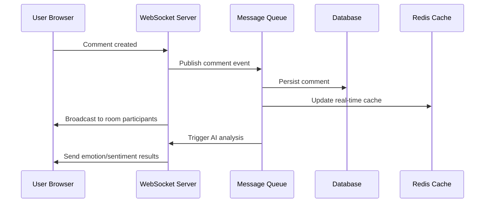
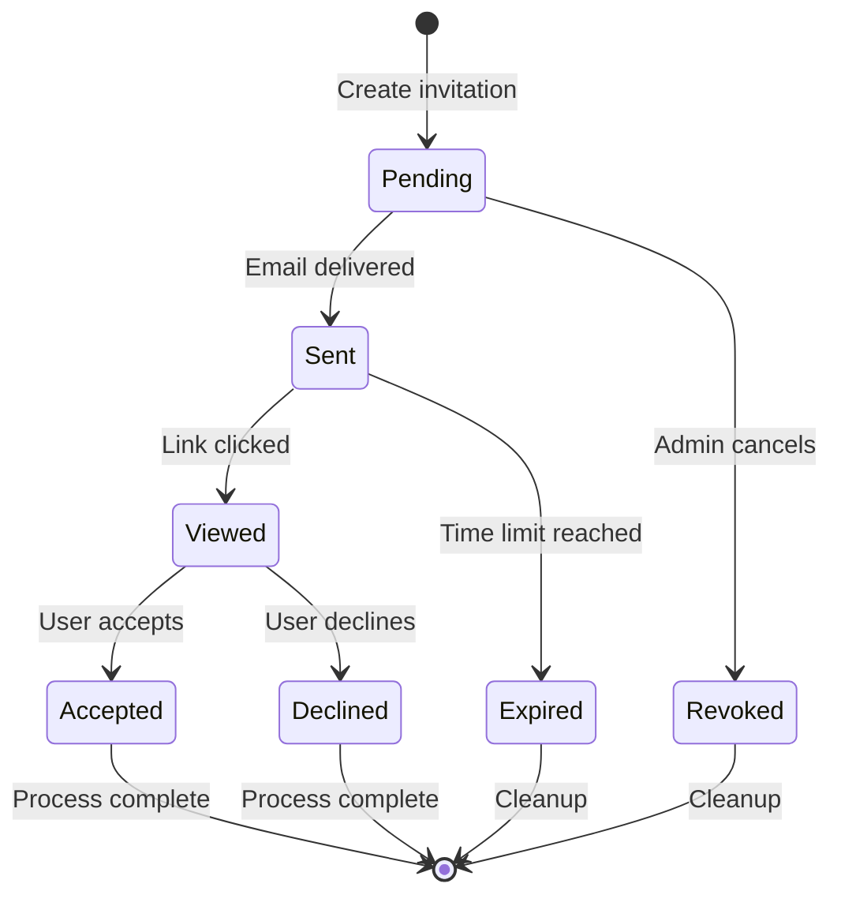
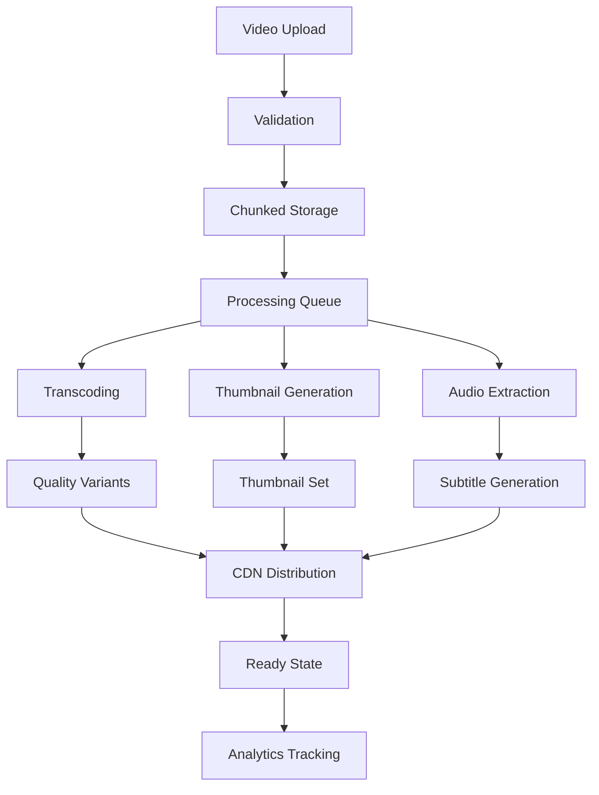

# Enhanced Video Feedback System - Data Architecture Strategy

## Executive Summary

This document outlines the comprehensive data architecture and pipeline design for the enhanced video feedback system. The architecture follows schema-first development principles with data products that directly align with business slices, ensuring trustworthy analytics and ML capabilities that accurately reflect shipped behavior.

## 1. Data Architecture Overview

### 1.1 Core Philosophy
- **Data as Products**: Every data artifact has clear ownership, versioning, and quality guarantees
- **Schema-First Development**: Versioned schemas in registry with backward compatibility
- **Slice-Oriented Architecture**: Clear ownership boundaries aligned to business slices
- **Data TDD Methodology**: Quality expectations written before implementation

### 1.2 Architecture Principles
1. **Type Safety**: Full TypeScript coverage with Zod schema validation
2. **Event Sourcing**: Immutable event log for state reconstruction
3. **CQRS Pattern**: Separate read/write models for optimal performance
4. **Real-time Capabilities**: WebSocket integration for live collaboration
5. **Data Quality First**: 99%+ quality pass rate for critical pipelines

## 2. Data Models and Schemas

### 2.1 Enhanced Entity Models

#### Invitation Management Entity
```typescript
// Location: /src/entities/invitation/model/types.ts
interface Invitation {
  id: string
  projectId: number
  inviterId: number
  inviteeEmail: string
  role: InvitationRole
  status: InvitationStatus
  permissions: InvitationPermissions
  metadata: InvitationMetadata
  emails: InvitationEmail[]
  links: InvitationLink[]
  auditLog: InvitationAuditEvent[]
}
```

**Key Features:**
- Email tracking with open rates, click rates, and delivery status
- Role-based permissions with granular controls
- Audit trail for compliance and security
- Batch invitation management for team onboarding
- GDPR compliance with consent tracking

#### Enhanced Comment System
```typescript
// Location: /src/entities/comment/model/types.ts
interface Comment {
  id: string
  content: string
  type: CommentType
  emotions: CommentEmotion[]
  reactions: CommentReaction[]
  attachments: CommentAttachment[]
  mentions: CommentMention[]
  threading: CommentThread
  aiAnalysis: CommentAIAnalysis
}
```

**Key Features:**
- Emotion detection with confidence scoring
- Nested replies with depth limiting (max 5 levels)
- Rich reactions system with emoji support
- Drawing and annotation attachments
- AI-powered sentiment analysis and topic extraction

#### Timestamp-Based Feedback
```typescript
// Location: /src/entities/feedback/model/enhanced-feedback.types.ts
interface EnhancedFeedback {
  id: string
  timestamp: VideoTimestamp
  region?: VideoRegion
  type: FeedbackType
  drawingData?: DrawingData
  voiceNoteData?: VoiceNoteData
  workflow: FeedbackWorkflow
  aiAnalysis: FeedbackAIAnalysis
}
```

**Key Features:**
- Precise video positioning (100ms accuracy)
- Multi-modal feedback (text, voice, drawings, screenshots)
- Region-based annotations with video overlay
- Automated workflow management
- ML-powered categorization and routing

#### Video Management
```typescript
// Location: /src/entities/video/model/types.ts
interface Video {
  id: string
  metadata: VideoMetadata
  qualities: VideoQualityVariant[]
  processingJobs: VideoProcessingJob[]
  analytics: VideoAnalytics
  security: VideoSecurity
  versions: VideoVersion[]
}
```

**Key Features:**
- Multi-quality adaptive streaming
- Progressive upload with chunked processing
- Version management with rollback capability
- Comprehensive analytics and engagement tracking
- Security features (DRM, watermarking, geo-blocking)

#### Analytics and Events
```typescript
// Location: /src/entities/analytics/model/types.ts
interface AnalyticsEvent {
  id: string
  category: EventCategory
  action: EventAction
  context: EventContext
  timestamp: string
  isAnonymized: boolean
  gdprConsent?: boolean
}
```

**Key Features:**
- Real-time event collection with batching
- Privacy-compliant data collection
- Device and network context tracking
- User behavior pattern analysis
- Performance and error monitoring

### 2.2 Schema Registry and Versioning

#### Schema Management Strategy
- **Avro Schemas**: For backward compatibility and evolution
- **Version Control**: Git-based schema versioning with semantic versioning
- **Migration Scripts**: Automated data migration between schema versions
- **Compatibility Matrix**: Clear compatibility rules between versions

```typescript
// Example schema evolution
interface InvitationV1 {
  id: string
  email: string
  status: string
}

interface InvitationV2 {
  id: string
  email: string
  status: InvitationStatus  // Enum instead of string
  permissions: InvitationPermissions  // New field
}
```

## 3. Data Flow Patterns

### 3.1 Real-time Comment Updates



### 3.2 Invitation Status Flow



### 3.3 Video Processing Pipeline



## 4. Data Pipeline Architecture

### 4.1 Ingestion Layer

#### Real-time Ingestion
- **WebSocket Streams**: User interactions, live collaboration
- **HTTP APIs**: Bulk data uploads, external integrations
- **Event Sourcing**: Immutable event log with replay capability

#### Batch Ingestion
- **File Uploads**: Video files, documents, bulk data imports
- **Scheduled Jobs**: External data synchronization, cleanup tasks
- **ETL Processes**: Data transformation and enrichment

### 4.2 Processing Layer

#### Stream Processing
```typescript
// Real-time event processing pipeline
interface EventProcessor {
  input: EventStream
  filters: EventFilter[]
  transformers: EventTransformer[]
  enrichers: EventEnricher[]
  outputs: EventSink[]
}
```

#### Batch Processing
- **Video Transcoding**: FFmpeg-based processing with queue management
- **ML Pipelines**: Sentiment analysis, object detection, topic modeling
- **Analytics Aggregation**: Daily, weekly, monthly metric calculations

### 4.3 Storage Layer

#### Primary Storage
- **PostgreSQL**: Transactional data with ACID compliance
- **Redis**: Real-time caching and session management
- **S3/MinIO**: File storage with CDN integration

#### Analytical Storage
- **Time-series DB**: Performance metrics and analytics
- **Data Warehouse**: Historical data for reporting and ML
- **Vector Store**: Embeddings for semantic search and AI features

## 5. Performance Considerations

### 5.1 Scalability Targets
- **Concurrent Users**: 10,000+ simultaneous users
- **Video Processing**: 1,000+ hours processed daily
- **Event Throughput**: 100,000+ events per second
- **Storage Growth**: 10TB+ monthly increase

### 5.2 Performance Optimizations

#### Database Optimization
```sql
-- Optimized indexes for common queries
CREATE INDEX CONCURRENTLY idx_feedback_project_timestamp 
ON feedback(project_id, timestamp) 
WHERE status = 'open';

CREATE INDEX CONCURRENTLY idx_comments_thread_created 
ON comments(thread_id, created_at) 
WHERE status = 'published';

-- Partitioning for analytics data
CREATE TABLE analytics_events_2024_01 PARTITION OF analytics_events
FOR VALUES FROM ('2024-01-01') TO ('2024-02-01');
```

#### Caching Strategy
- **Redis Layers**: L1 (hot data), L2 (warm data), L3 (cold data)
- **CDN Integration**: Global content distribution
- **Application Caching**: In-memory caching for frequently accessed data

#### Real-time Performance
- **WebSocket Optimization**: Connection pooling, message batching
- **Event Deduplication**: Prevent duplicate processing
- **Load Balancing**: Horizontal scaling with session affinity

### 5.3 Data Quality Monitoring

#### Quality Metrics
```typescript
interface QualityMetrics {
  completeness: number    // 0-100
  accuracy: number       // 0-100
  consistency: number    // 0-100
  validity: number       // 0-100
  timeliness: number     // 0-100
  uniqueness: number     // 0-100
}
```

#### Automated Quality Checks
- **Schema Validation**: Zod-based type checking
- **Business Rule Validation**: Custom validation logic
- **Data Profiling**: Statistical analysis of data quality
- **Anomaly Detection**: ML-based outlier identification

## 6. Integration Strategy

### 6.1 Existing System Integration

#### Django Backend Integration
```python
# Django model integration
class VideoFeedback(models.Model):
    id = models.UUIDField(primary_key=True)
    project = models.ForeignKey(Project, on_delete=models.CASCADE)
    timestamp_data = models.JSONField()  # VideoTimestamp
    region_data = models.JSONField(null=True)  # VideoRegion
    ai_analysis = models.JSONField(null=True)  # AIAnalysis
    
    class Meta:
        indexes = [
            models.Index(fields=['project', 'created_at']),
            models.Index(fields=['timestamp_data__currentTime']),
        ]
```

#### Redux Store Integration
```typescript
// Enhanced store configuration
export const store = configureStore({
  reducer: {
    invitation: invitationReducer,
    comment: commentReducer,
    feedback: enhancedFeedbackReducer,
    video: videoReducer,
    analytics: analyticsReducer,
  },
  middleware: (getDefaultMiddleware) =>
    getDefaultMiddleware({
      serializableCheck: {
        ignoredActions: ['persist/PERSIST', 'analytics/batchEvents'],
      },
    }).concat([
      dataQualityMiddleware,
      analyticsMiddleware,
      realtimeMiddleware,
    ]),
})
```

### 6.2 API Design Strategy

#### RESTful APIs
```typescript
// Type-safe API routes
interface APIRoutes {
  // Invitation management
  'POST /api/invitations': CreateInvitationRequest → InvitationResponse
  'GET /api/invitations/:id': void → InvitationResponse
  'PUT /api/invitations/:id': UpdateInvitationRequest → InvitationResponse
  
  // Enhanced feedback
  'POST /api/feedback': CreateFeedbackRequest → FeedbackResponse
  'GET /api/feedback': FeedbackFilters → FeedbackListResponse
  'PUT /api/feedback/:id': UpdateFeedbackRequest → FeedbackResponse
  
  // Analytics
  'POST /api/analytics/events': AnalyticsEvent[] → void
  'GET /api/analytics/dashboard': AnalyticsFilters → DashboardData
}
```

#### GraphQL Schema
```graphql
type Query {
  feedback(projectId: ID!, filters: FeedbackFilters): FeedbackConnection
  comments(videoId: ID!, sort: CommentSort): CommentConnection
  invitations(projectId: ID!): InvitationConnection
  analytics(timeRange: TimeRange!): AnalyticsSummary
}

type Mutation {
  createFeedback(input: CreateFeedbackInput!): Feedback
  updateComment(id: ID!, input: UpdateCommentInput!): Comment
  inviteUser(input: InviteUserInput!): Invitation
}

type Subscription {
  feedbackUpdates(projectId: ID!): Feedback
  commentUpdates(videoId: ID!): Comment
  collaborationEvents(projectId: ID!): CollaborationEvent
}
```

### 6.3 Migration Strategy

#### Phase 1: Infrastructure Setup (Weeks 1-2)
- [ ] Set up schema registry and validation framework
- [ ] Implement data quality monitoring
- [ ] Create enhanced entity models
- [ ] Set up event streaming infrastructure

#### Phase 2: Core Features (Weeks 3-6)
- [ ] Invitation management system
- [ ] Enhanced comment system with emotions
- [ ] Timestamp-based feedback
- [ ] Basic analytics pipeline

#### Phase 3: Advanced Features (Weeks 7-10)
- [ ] AI-powered analysis and recommendations
- [ ] Advanced video processing pipeline
- [ ] Real-time collaboration features
- [ ] Comprehensive dashboard and reporting

#### Phase 4: Optimization and Scale (Weeks 11-12)
- [ ] Performance optimization
- [ ] Load testing and capacity planning
- [ ] Advanced analytics and ML features
- [ ] Production deployment and monitoring

## 7. Monitoring and Observability

### 7.1 Data Pipeline Monitoring

#### Key Metrics
- **Data Quality Score**: Overall quality across all pipelines
- **Processing Latency**: End-to-end processing time
- **Error Rate**: Failed processing percentage
- **Throughput**: Events processed per second
- **Cost per Transaction**: Economic efficiency metrics

#### Alerting Strategy
```typescript
interface AlertConfig {
  metric: string
  threshold: number
  severity: 'low' | 'medium' | 'high' | 'critical'
  channels: ('slack' | 'email' | 'pagerduty')[]
  runbook?: string
}

const alerts: AlertConfig[] = [
  {
    metric: 'data_quality_score',
    threshold: 95,
    severity: 'high',
    channels: ['slack', 'email'],
    runbook: 'https://docs.company.com/runbooks/data-quality'
  },
  {
    metric: 'processing_latency_p99',
    threshold: 5000, // 5 seconds
    severity: 'medium',
    channels: ['slack']
  }
]
```

### 7.2 Business Metrics

#### User Engagement
- **Feedback Completion Rate**: Percentage of started feedback completed
- **Comment Response Time**: Average time to first reply
- **Invitation Acceptance Rate**: Success rate of invitations
- **Collaboration Efficiency**: Time saved through real-time features

#### Technical Performance
- **Video Load Time**: Time to first frame
- **Search Response Time**: Query response latency
- **Real-time Message Latency**: WebSocket message delay
- **API Success Rate**: HTTP 2xx response percentage

## 8. Security and Compliance

### 8.1 Data Privacy

#### GDPR Compliance
- **Consent Management**: Granular consent tracking
- **Data Minimization**: Collect only necessary data
- **Right to Erasure**: Automated data deletion workflows
- **Data Portability**: Export user data in standard formats

#### Anonymization Strategy
```typescript
interface AnonymizationRules {
  personalData: {
    email: 'hash',
    ipAddress: 'subnet_mask',
    userId: 'pseudonymize'
  },
  retentionPeriod: 24, // hours before anonymization
  exceptions: ['audit_logs', 'legal_hold']
}
```

### 8.2 Access Control

#### Role-Based Permissions
```typescript
interface PermissionMatrix {
  viewer: {
    canViewVideo: true,
    canComment: false,
    canInvite: false,
    canExport: false
  },
  commenter: {
    canViewVideo: true,
    canComment: true,
    canInvite: false,
    canExport: false
  },
  editor: {
    canViewVideo: true,
    canComment: true,
    canInvite: true,
    canExport: true
  }
}
```

### 8.3 Audit Trail

#### Comprehensive Logging
- **User Actions**: All user interactions with timestamps
- **Data Changes**: Before/after values for all modifications
- **System Events**: Automated processing and error events
- **Access Logs**: Authentication and authorization events

## 9. Cost Optimization

### 9.1 Storage Optimization

#### Tiered Storage Strategy
- **Hot Tier**: Recent and frequently accessed data (SSD)
- **Warm Tier**: Moderately accessed data (Standard storage)
- **Cold Tier**: Archival data (Glacier/Deep Archive)
- **Intelligent Tiering**: Automated movement between tiers

#### Data Lifecycle Management
```typescript
interface DataLifecyclePolicy {
  videoFiles: {
    active: 90,        // days in hot storage
    archive: 365,      // days before cold storage
    delete: 2555,      // days before deletion (7 years)
  },
  analyticsEvents: {
    detailed: 90,      // days for full event data
    aggregated: 730,   // days for aggregated data
    delete: 2555,      // regulatory requirement
  }
}
```

### 9.2 Processing Optimization

#### Smart Resource Allocation
- **Auto-scaling**: Scale processing based on queue depth
- **Spot Instances**: Use spot instances for batch processing
- **GPU Optimization**: Efficient GPU utilization for AI workloads
- **Caching**: Reduce redundant processing through intelligent caching

## 10. Future Roadmap

### 10.1 Short-term Enhancements (Next 6 months)
- [ ] Advanced AI features (automated feedback categorization)
- [ ] Mobile app integration
- [ ] Offline capability with sync
- [ ] Advanced video analytics (engagement heatmaps)

### 10.2 Medium-term Goals (6-18 months)
- [ ] Multi-tenant architecture
- [ ] Advanced collaboration features (live co-editing)
- [ ] Integration with external tools (Slack, Teams, Jira)
- [ ] Custom workflow automation

### 10.3 Long-term Vision (18+ months)
- [ ] AI-powered content generation
- [ ] Predictive analytics and recommendations
- [ ] Global content delivery network
- [ ] Advanced security features (zero-trust architecture)

## 11. Success Metrics

### 11.1 Technical KPIs
- **Data Quality Pass Rate**: >99% for critical pipelines
- **API Response Time**: <200ms p95
- **System Uptime**: >99.9%
- **Error Rate**: <0.1%

### 11.2 Business KPIs
- **User Engagement**: 50% increase in feedback completion
- **Collaboration Efficiency**: 40% reduction in review cycles
- **User Satisfaction**: NPS score >50
- **Cost Efficiency**: 30% reduction in operational costs

### 11.3 Data Pipeline KPIs
- **Processing Latency**: <5 seconds for real-time events
- **Data Freshness**: <1 minute for dashboards
- **Schema Compatibility**: 100% backward compatibility
- **Cost per GB**: <$0.10 for storage and processing

---

## Conclusion

This data architecture strategy provides a comprehensive foundation for the enhanced video feedback system. By following schema-first development principles and implementing robust data quality measures, we ensure that the system can scale efficiently while maintaining high reliability and user satisfaction.

The architecture emphasizes:
1. **Type Safety**: Full TypeScript coverage with runtime validation
2. **Data Quality**: Comprehensive validation and monitoring
3. **Real-time Capabilities**: WebSocket-based live collaboration
4. **Scalability**: Designed for 10,000+ concurrent users
5. **Compliance**: GDPR-ready with privacy-by-design principles

This foundation enables rapid feature development while maintaining the highest standards of data integrity and system reliability.

---

**Document Version**: 1.0.0  
**Last Updated**: 2025-08-22  
**Author**: Daniel (Data Lead) - Enhanced Video Feedback System  
**Review Cycle**: Monthly  
**Next Review**: 2025-09-22