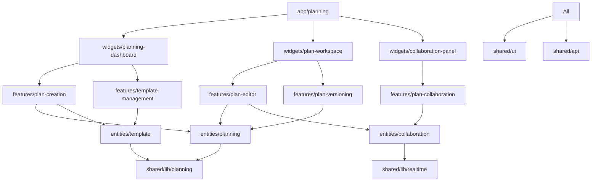

# VideoPlanet 영상 기획 시스템 FSD 아키텍처 설계

## 1. 아키텍처 개요

### 1.1 Feature-Sliced Design 레이어 구조
```
app → processes → pages → widgets → features → entities → shared
```

### 1.2 의존성 규칙 (Dependency Rules)
- **하위 레이어는 상위 레이어를 import할 수 없음**
- **같은 레이어 내 slice 간 직접 import 금지**
- **모든 import는 public API (index.ts)를 통해서만 가능**

### 1.3 영상 기획 도메인 경계 정의
- **Planning Domain**: 영상 기획서 작성, 템플릿, 버전 관리
- **Collaboration Domain**: 실시간 협업, 댓글, 공유
- **Template Domain**: 기획서 템플릿 관리
- **Analytics Domain**: 기획서 분석 및 통계

## 2. Entities Layer (도메인 엔티티)

### 2.1 Planning Entity
```
src/entities/planning/
├── model/
│   ├── types.ts           # 영상 기획 타입 정의 ✅
│   ├── planning.slice.ts  # Redux 상태 관리
│   ├── selectors.ts       # Redux 선택자
│   └── constants.ts       # 도메인 상수
├── lib/
│   ├── validation.ts      # 기획서 검증 로직
│   ├── utils.ts          # 유틸리티 함수
│   └── formatters.ts      # 데이터 포맷팅
├── api/
│   └── planning.api.ts    # API 통신 로직
└── index.ts              # Public API
```

**책임:**
- VideoPlan, PlanSection, PlanVersion 등 핵심 도메인 모델
- 기획서 상태 관리 (Redux slice)
- 기획서 검증 및 변환 로직
- 기획서 API 통신

### 2.2 Template Entity
```
src/entities/template/
├── model/
│   ├── types.ts          # 템플릿 타입 정의
│   ├── template.slice.ts # 템플릿 상태 관리
│   └── selectors.ts      # 템플릿 선택자
├── lib/
│   ├── template-engine.ts # 템플릿 렌더링 엔진
│   └── validation.ts      # 템플릿 검증
├── api/
│   └── template.api.ts    # 템플릿 API
└── index.ts              # Public API
```

### 2.3 Collaboration Entity
```
src/entities/collaboration/
├── model/
│   ├── types.ts              # 협업 타입 정의
│   ├── collaboration.slice.ts # 협업 상태 관리
│   └── realtime.slice.ts     # 실시간 상태
├── lib/
│   ├── websocket.ts          # WebSocket 관리
│   ├── presence.ts           # 사용자 존재감
│   └── conflict-resolution.ts # 충돌 해결
├── api/
│   └── collaboration.api.ts   # 협업 API
└── index.ts                  # Public API
```

## 3. Features Layer (비즈니스 기능)

### 3.1 Plan Creation Feature
```
src/features/plan-creation/
├── ui/
│   ├── PlanCreationForm.tsx       # 기획서 생성 폼
│   ├── TemplateSelector.tsx       # 템플릿 선택기
│   ├── SectionBuilder.tsx         # 섹션 구성기
│   └── PlanCreationModal.tsx      # 생성 모달
├── model/
│   ├── creation.slice.ts          # 생성 상태 관리
│   ├── hooks.ts                   # 생성 관련 훅
│   └── validation.ts              # 생성 검증
├── lib/
│   ├── creation-workflow.ts       # 생성 워크플로우
│   └── template-processor.ts      # 템플릿 처리
└── index.ts                       # Public API
```

**책임:**
- 새로운 기획서 생성
- 템플릿 기반 기획서 초기화
- 기획서 구조 설정
- 협업자 초기 설정

### 3.2 Plan Editor Feature
```
src/features/plan-editor/
├── ui/
│   ├── PlanEditor.tsx            # 메인 에디터
│   ├── SectionEditor.tsx         # 섹션 편집기
│   ├── RichTextEditor.tsx        # 리치 텍스트 에디터
│   ├── AttachmentManager.tsx     # 첨부파일 관리
│   └── AutoSaveIndicator.tsx     # 자동저장 표시
├── model/
│   ├── editor.slice.ts           # 편집 상태
│   ├── autosave.slice.ts         # 자동저장 상태
│   └── hooks.ts                  # 편집 훅
├── lib/
│   ├── editor-commands.ts        # 편집 명령
│   ├── autosave.ts              # 자동저장 로직
│   └── keyboard-shortcuts.ts    # 키보드 단축키
└── index.ts                     # Public API
```

### 3.3 Plan Collaboration Feature
```
src/features/plan-collaboration/
├── ui/
│   ├── CollaboratorList.tsx      # 협업자 목록
│   ├── CommentSystem.tsx         # 댓글 시스템
│   ├── PresenceIndicator.tsx     # 실시간 존재감
│   ├── ShareDialog.tsx           # 공유 다이얼로그
│   └── PermissionManager.tsx     # 권한 관리
├── model/
│   ├── collaboration.slice.ts    # 협업 상태
│   ├── realtime.ts              # 실시간 훅
│   └── permissions.ts           # 권한 로직
├── lib/
│   ├── realtime-sync.ts         # 실시간 동기화
│   ├── conflict-resolver.ts     # 충돌 해결
│   └── notification.ts          # 알림 처리
└── index.ts                     # Public API
```

### 3.4 Plan Versioning Feature
```
src/features/plan-versioning/
├── ui/
│   ├── VersionHistory.tsx        # 버전 이력
│   ├── VersionComparison.tsx     # 버전 비교
│   ├── VersionRestore.tsx        # 버전 복원
│   └── VersionTags.tsx           # 버전 태그
├── model/
│   ├── versioning.slice.ts       # 버전 상태
│   └── hooks.ts                  # 버전 훅
├── lib/
│   ├── version-diff.ts           # 버전 비교
│   ├── snapshot-manager.ts       # 스냅샷 관리
│   └── merge-strategy.ts         # 병합 전략
└── index.ts                     # Public API
```

### 3.5 Template Management Feature
```
src/features/template-management/
├── ui/
│   ├── TemplateLibrary.tsx       # 템플릿 라이브러리
│   ├── TemplateCreator.tsx       # 템플릿 생성기
│   ├── TemplatePreview.tsx       # 템플릿 미리보기
│   └── TemplateEditor.tsx        # 템플릿 편집기
├── model/
│   ├── template-management.slice.ts
│   └── hooks.ts
├── lib/
│   ├── template-builder.ts       # 템플릿 빌더
│   └── template-validator.ts     # 템플릿 검증
└── index.ts                     # Public API
```

## 4. Widgets Layer (복합 컴포넌트)

### 4.1 Planning Dashboard Widget
```
src/widgets/planning-dashboard/
├── ui/
│   ├── PlanningDashboard.tsx     # 메인 대시보드
│   ├── PlanList.tsx              # 기획서 목록
│   ├── QuickActions.tsx          # 빠른 작업
│   ├── RecentPlans.tsx           # 최근 기획서
│   └── PlanStats.tsx             # 통계
├── model/
│   ├── dashboard.slice.ts        # 대시보드 상태
│   └── hooks.ts                  # 대시보드 훅
├── lib/
│   └── dashboard-utils.ts        # 대시보드 유틸
└── index.ts                     # Public API
```

**책임:**
- 전체 기획서 현황 표시
- 최근 작업 기획서 목록
- 빠른 생성/편집 액세스
- 통계 및 분석 정보

### 4.2 Plan Workspace Widget
```
src/widgets/plan-workspace/
├── ui/
│   ├── PlanWorkspace.tsx         # 작업 공간
│   ├── WorkspaceHeader.tsx       # 헤더
│   ├── WorkspaceSidebar.tsx      # 사이드바
│   ├── WorkspaceToolbar.tsx      # 도구모음
│   └── WorkspaceFooter.tsx       # 푸터
├── model/
│   ├── workspace.slice.ts        # 작업공간 상태
│   └── layout.slice.ts           # 레이아웃 상태
├── lib/
│   └── workspace-layout.ts       # 레이아웃 관리
└── index.ts                     # Public API
```

### 4.3 Collaboration Panel Widget
```
src/widgets/collaboration-panel/
├── ui/
│   ├── CollaborationPanel.tsx    # 협업 패널
│   ├── ActiveUsers.tsx           # 활성 사용자
│   ├── CommentThread.tsx         # 댓글 스레드
│   ├── ActivityFeed.tsx          # 활동 피드
│   └── NotificationCenter.tsx    # 알림 센터
├── model/
│   ├── panel.slice.ts            # 패널 상태
│   └── activity.slice.ts         # 활동 상태
└── index.ts                     # Public API
```

## 5. Pages Layer (라우트 페이지)

### 5.1 Planning Pages Structure
```
src/app/planning/
├── page.tsx                      # 기획 메인 페이지 (기존)
├── create/
│   └── page.tsx                  # 새 기획서 생성
├── [id]/
│   ├── page.tsx                  # 기획서 상세/편집
│   ├── edit/
│   │   └── page.tsx              # 편집 전용 페이지
│   ├── share/
│   │   └── page.tsx              # 공유 페이지
│   └── versions/
│       └── page.tsx              # 버전 관리 페이지
├── templates/
│   ├── page.tsx                  # 템플릿 라이브러리
│   └── [templateId]/
│       └── page.tsx              # 템플릿 상세
└── dashboard/
    └── page.tsx                  # 기획 대시보드
```

## 6. Shared Layer (공통 모듈)

### 6.1 Planning Specific Shared Modules
```
src/shared/
├── ui/
│   ├── PlanningFormControls/     # 기획 전용 폼 컨트롤
│   │   ├── SectionTypeSelector.tsx
│   │   ├── PrioritySelector.tsx
│   │   ├── StatusBadge.tsx
│   │   └── CollaboratorAvatar.tsx
│   └── PlanningLayout/           # 기획 레이아웃
│       ├── PlanningHeader.tsx
│       ├── PlanningSidebar.tsx
│       └── PlanningToolbar.tsx
├── lib/
│   ├── planning/                 # 기획 공통 로직
│   │   ├── constants.ts          # 기획 상수
│   │   ├── validators.ts         # 검증 함수
│   │   ├── formatters.ts         # 포맷팅 함수
│   │   ├── permissions.ts        # 권한 체크
│   │   └── analytics.ts          # 분석 유틸
│   └── realtime/                # 실시간 통신
│       ├── websocket-manager.ts
│       ├── event-handlers.ts
│       └── presence-tracker.ts
└── api/
    └── planning/                # 기획 API 설정
        ├── endpoints.ts
        ├── interceptors.ts
        └── types.ts
```

## 7. 의존성 플로우 다이어그램



## 8. Public API 설계 원칙

### 8.1 Entity Layer Public API
각 엔티티는 다음 구조로 export:
```typescript
// entities/planning/index.ts
export type { VideoPlan, PlanSection, CreatePlanRequest } from './model/types'
export { 
  planningReducer, 
  planningActions,
  selectCurrentPlan,
  selectPlansByStatus 
} from './model/planning.slice'
export { planningApi } from './api/planning.api'
export { validatePlan, formatPlanDate } from './lib/validation'
```

### 8.2 Feature Layer Public API
각 피처는 컴포넌트와 훅만 export:
```typescript
// features/plan-creation/index.ts
export { PlanCreationForm } from './ui/PlanCreationForm'
export { TemplateSelector } from './ui/TemplateSelector'
export { usePlanCreation, useTemplateSelection } from './model/hooks'
```

### 8.3 Widget Layer Public API
각 위젯은 메인 컴포넌트만 export:
```typescript
// widgets/planning-dashboard/index.ts
export { PlanningDashboard } from './ui/PlanningDashboard'
```

## 9. 레이어 간 통신 규칙

### 9.1 허용된 Import 패턴
- ✅ `widgets` → `features`
- ✅ `features` → `entities`
- ✅ `entities` → `shared`
- ✅ `app` → `widgets`
- ✅ 모든 레이어 → `shared`

### 9.2 금지된 Import 패턴
- ❌ `entities` → `features`
- ❌ `shared` → `entities`
- ❌ 같은 레이어 내 직접 import
- ❌ private 모듈 직접 import

### 9.3 Cross-Cutting Concerns 처리
실시간 통신, 권한 관리 등은 shared layer의 lib 모듈에서 관리:
```typescript
// shared/lib/realtime/websocket-manager.ts
export class WebSocketManager {
  // 실시간 통신 로직
}

// entities/collaboration/lib/websocket.ts
import { WebSocketManager } from '@/shared/lib/realtime'
```

## 10. 테스팅 전략

### 10.1 Layer별 테스트 접근법
- **Entities**: 단위 테스트 (로직, 상태 관리)
- **Features**: 컴포넌트 테스트 (UI 상호작용)
- **Widgets**: 통합 테스트 (워크플로우)
- **Pages**: E2E 테스트 (사용자 여정)

### 10.2 테스트 파일 구조
```
src/entities/planning/
├── __tests__/
│   ├── planning.slice.test.ts
│   ├── validation.test.ts
│   └── planning.api.test.ts
```

## 11. 마이그레이션 전략

### 11.1 기존 Planning Page 리팩토링
현재 `/src/app/planning/page.tsx`는 캘린더 중심이므로:
1. 기존 페이지를 `/src/app/planning/calendar/page.tsx`로 이동
2. 새로운 기획 대시보드를 메인 페이지로 설정
3. 기존 프로젝트 데이터와 새로운 기획서 데이터 연결

### 11.2 점진적 마이그레이션 로드맵
**Phase 1**: Entities Layer 구축
- planning, template, collaboration entities
- Redux 상태 관리 설정

**Phase 2**: Core Features 개발
- plan-creation, plan-editor features
- 기본 CRUD 기능

**Phase 3**: Advanced Features
- collaboration, versioning features
- 실시간 기능

**Phase 4**: Widgets & Pages
- 복합 컴포넌트 구성
- 사용자 인터페이스 완성

이 아키텍처는 **확장성**, **유지보수성**, **테스트 가능성**을 보장하며, 팀원들이 독립적으로 각자의 레이어에서 작업할 수 있도록 설계되었습니다.