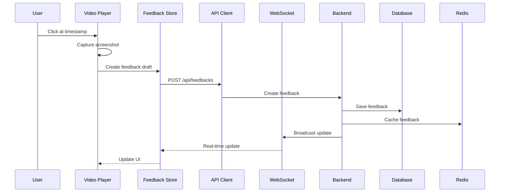
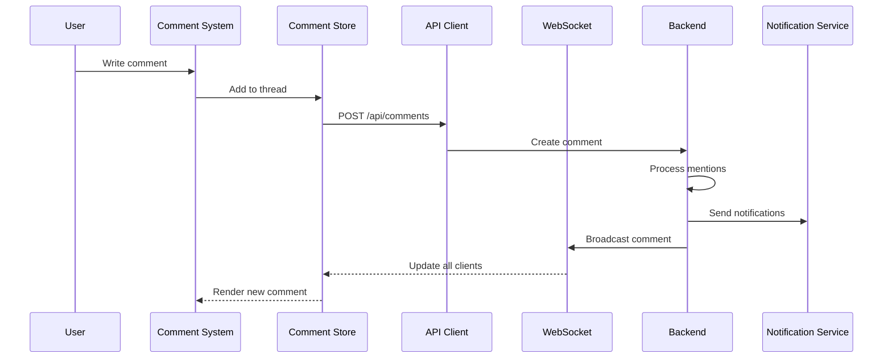
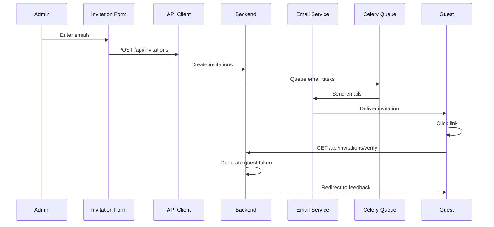

# VideoPlanet 피드백 시스템 통합 아키텍처

## 1. 시스템 개요

VideoPlanet 피드백 시스템의 전체 통합 아키텍처를 정의합니다. 본 문서는 ADR (Architecture Decision Record) 형식을 따르며, FSD 방법론과 TDD 원칙을 준수합니다.

### 1.1 아키텍처 원칙
- **Feature-Sliced Design (FSD)**: 명확한 계층 분리와 단방향 의존성
- **도메인 주도 설계 (DDD)**: 비즈니스 로직의 중앙 집중화
- **이벤트 기반 아키텍처**: 실시간 업데이트와 느슨한 결합
- **API-First 설계**: OpenAPI 명세를 통한 계약 우선 개발

### 1.2 기술 스택
```yaml
Frontend:
  - Framework: Next.js 15 (App Router)
  - UI Library: React 19
  - State Management: Redux Toolkit + RTK Query
  - Styling: CSS Modules + SCSS (통합 디자인 토큰)
  - Real-time: WebSocket (Django Channels)

Backend:
  - Framework: Django 4.2+
  - API: Django REST Framework
  - Real-time: Django Channels
  - Cache: Redis
  - Database: PostgreSQL
  - Task Queue: Celery

Infrastructure:
  - Frontend Hosting: Vercel
  - Backend Hosting: Railway
  - File Storage: AWS S3 / Cloudinary
  - CDN: CloudFront
```

## 2. 시스템 통합 다이어그램

```mermaid
graph TB
    subgraph "Frontend (Next.js)"
        subgraph "App Layer"
            APP[App Router]
            MW[Middleware]
        end
        
        subgraph "Process Layer"
            INVITE_FLOW[Invitation Flow]
            FEEDBACK_FLOW[Feedback Flow]
        end
        
        subgraph "Widget Layer"
            VIDEO_PLAYER[Enhanced Video Player]
            COMMENT_WIDGET[Comment System]
            PROJECT_INFO[Project Info Widget]
        end
        
        subgraph "Feature Layer"
            AUTH_FEAT[Auth Feature]
            FEEDBACK_FEAT[Feedback Feature]
            COMMENT_FEAT[Comment Feature]
            INVITE_FEAT[Invitation Feature]
        end
        
        subgraph "Entity Layer"
            USER_ENTITY[User Entity]
            PROJECT_ENTITY[Project Entity]
            VIDEO_ENTITY[Video Entity]
            FEEDBACK_ENTITY[Feedback Entity]
            COMMENT_ENTITY[Comment Entity]
        end
        
        subgraph "Shared Layer"
            API_CLIENT[API Client]
            WS_CLIENT[WebSocket Client]
            STORE[Redux Store]
            CACHE[Cache Manager]
        end
    end
    
    subgraph "API Gateway"
        NGINX[Nginx / API Gateway]
        RATE_LIMIT[Rate Limiter]
        AUTH_MW[Auth Middleware]
    end
    
    subgraph "Backend (Django)"
        subgraph "API Layer"
            REST_API[REST API]
            WS_API[WebSocket API]
            GRAPHQL[GraphQL (Future)]
        end
        
        subgraph "Service Layer"
            AUTH_SVC[Auth Service]
            FEEDBACK_SVC[Feedback Service]
            VIDEO_SVC[Video Service]
            EMAIL_SVC[Email Service]
            NOTIFICATION_SVC[Notification Service]
        end
        
        subgraph "Domain Layer"
            USER_MODEL[User Model]
            PROJECT_MODEL[Project Model]
            FEEDBACK_MODEL[Feedback Model]
            COMMENT_MODEL[Comment Model]
            INVITE_MODEL[Invitation Model]
        end
        
        subgraph "Infrastructure Layer"
            DB[(PostgreSQL)]
            REDIS[(Redis)]
            S3[S3 Storage]
            CELERY[Celery Tasks]
        end
    end
    
    %% Data Flow
    APP --> MW
    MW --> INVITE_FLOW
    MW --> FEEDBACK_FLOW
    
    INVITE_FLOW --> INVITE_FEAT
    FEEDBACK_FLOW --> VIDEO_PLAYER
    FEEDBACK_FLOW --> COMMENT_WIDGET
    
    VIDEO_PLAYER --> FEEDBACK_FEAT
    COMMENT_WIDGET --> COMMENT_FEAT
    PROJECT_INFO --> PROJECT_ENTITY
    
    AUTH_FEAT --> USER_ENTITY
    FEEDBACK_FEAT --> FEEDBACK_ENTITY
    COMMENT_FEAT --> COMMENT_ENTITY
    INVITE_FEAT --> USER_ENTITY
    
    USER_ENTITY --> STORE
    PROJECT_ENTITY --> STORE
    VIDEO_ENTITY --> STORE
    FEEDBACK_ENTITY --> STORE
    COMMENT_ENTITY --> STORE
    
    API_CLIENT --> NGINX
    WS_CLIENT --> NGINX
    
    NGINX --> REST_API
    NGINX --> WS_API
    
    REST_API --> AUTH_SVC
    REST_API --> FEEDBACK_SVC
    REST_API --> VIDEO_SVC
    REST_API --> EMAIL_SVC
    
    WS_API --> NOTIFICATION_SVC
    
    AUTH_SVC --> USER_MODEL
    FEEDBACK_SVC --> FEEDBACK_MODEL
    VIDEO_SVC --> PROJECT_MODEL
    EMAIL_SVC --> INVITE_MODEL
    NOTIFICATION_SVC --> COMMENT_MODEL
    
    USER_MODEL --> DB
    PROJECT_MODEL --> DB
    FEEDBACK_MODEL --> DB
    COMMENT_MODEL --> DB
    INVITE_MODEL --> DB
    
    NOTIFICATION_SVC --> REDIS
    AUTH_SVC --> REDIS
    VIDEO_SVC --> S3
    EMAIL_SVC --> CELERY
```

## 3. 데이터 플로우 아키텍처

### 3.1 피드백 생성 플로우


### 3.2 댓글 스레드 플로우


### 3.3 이메일 초대 플로우


## 4. API 계약 명세 (OpenAPI)

### 4.1 피드백 API
```yaml
openapi: 3.1.0
info:
  title: VideoPlanet Feedback API
  version: 1.0.0
  
paths:
  /api/v1/feedbacks:
    post:
      summary: Create new feedback
      operationId: createFeedback
      tags: [Feedback]
      requestBody:
        required: true
        content:
          application/json:
            schema:
              $ref: '#/components/schemas/CreateFeedbackRequest'
      responses:
        '201':
          description: Feedback created
          content:
            application/json:
              schema:
                $ref: '#/components/schemas/FeedbackResponse'
                
    get:
      summary: List feedbacks
      operationId: listFeedbacks
      tags: [Feedback]
      parameters:
        - name: project_id
          in: query
          required: true
          schema:
            type: string
            format: uuid
        - name: video_id
          in: query
          schema:
            type: string
            format: uuid
      responses:
        '200':
          description: List of feedbacks
          content:
            application/json:
              schema:
                type: array
                items:
                  $ref: '#/components/schemas/FeedbackResponse'

  /api/v1/feedbacks/{id}:
    get:
      summary: Get feedback by ID
      operationId: getFeedback
      tags: [Feedback]
      parameters:
        - name: id
          in: path
          required: true
          schema:
            type: string
            format: uuid
      responses:
        '200':
          description: Feedback details
          content:
            application/json:
              schema:
                $ref: '#/components/schemas/FeedbackResponse'
                
    patch:
      summary: Update feedback
      operationId: updateFeedback
      tags: [Feedback]
      parameters:
        - name: id
          in: path
          required: true
          schema:
            type: string
            format: uuid
      requestBody:
        required: true
        content:
          application/json:
            schema:
              $ref: '#/components/schemas/UpdateFeedbackRequest'
      responses:
        '200':
          description: Updated feedback
          content:
            application/json:
              schema:
                $ref: '#/components/schemas/FeedbackResponse'

components:
  schemas:
    CreateFeedbackRequest:
      type: object
      required:
        - video_id
        - timestamp
        - content
      properties:
        video_id:
          type: string
          format: uuid
        timestamp:
          type: number
          format: float
          description: Timestamp in seconds
        content:
          type: string
          minLength: 1
          maxLength: 5000
        screenshot:
          type: string
          format: base64
          description: Base64 encoded screenshot
        drawing_data:
          type: object
          properties:
            shapes:
              type: array
              items:
                $ref: '#/components/schemas/DrawingShape'
        priority:
          type: string
          enum: [low, medium, high, critical]
          default: medium
        tags:
          type: array
          items:
            type: string
            
    UpdateFeedbackRequest:
      type: object
      properties:
        content:
          type: string
          maxLength: 5000
        status:
          type: string
          enum: [open, in_progress, resolved, closed]
        priority:
          type: string
          enum: [low, medium, high, critical]
        tags:
          type: array
          items:
            type: string
            
    FeedbackResponse:
      type: object
      properties:
        id:
          type: string
          format: uuid
        video_id:
          type: string
          format: uuid
        user:
          $ref: '#/components/schemas/UserInfo'
        timestamp:
          type: number
          format: float
        content:
          type: string
        screenshot_url:
          type: string
          format: uri
        drawing_data:
          type: object
        priority:
          type: string
          enum: [low, medium, high, critical]
        status:
          type: string
          enum: [open, in_progress, resolved, closed]
        tags:
          type: array
          items:
            type: string
        created_at:
          type: string
          format: date-time
        updated_at:
          type: string
          format: date-time
        comments_count:
          type: integer
        reactions:
          type: object
          additionalProperties:
            type: integer
            
    DrawingShape:
      type: object
      properties:
        type:
          type: string
          enum: [rectangle, circle, arrow, text]
        coordinates:
          type: array
          items:
            type: number
        style:
          type: object
          properties:
            color:
              type: string
            width:
              type: number
            
    UserInfo:
      type: object
      properties:
        id:
          type: string
          format: uuid
        name:
          type: string
        email:
          type: string
          format: email
        avatar_url:
          type: string
          format: uri
```

### 4.2 댓글 API
```yaml
paths:
  /api/v1/comments:
    post:
      summary: Create comment
      operationId: createComment
      tags: [Comments]
      requestBody:
        required: true
        content:
          application/json:
            schema:
              $ref: '#/components/schemas/CreateCommentRequest'
      responses:
        '201':
          description: Comment created
          content:
            application/json:
              schema:
                $ref: '#/components/schemas/CommentResponse'
                
  /api/v1/comments/{id}/reactions:
    post:
      summary: Add reaction to comment
      operationId: addReaction
      tags: [Comments]
      parameters:
        - name: id
          in: path
          required: true
          schema:
            type: string
            format: uuid
      requestBody:
        required: true
        content:
          application/json:
            schema:
              type: object
              properties:
                emoji:
                  type: string
                  pattern: '^[\u{1F300}-\u{1FAD6}]$'
      responses:
        '200':
          description: Reaction added
          
components:
  schemas:
    CreateCommentRequest:
      type: object
      required:
        - feedback_id
        - content
      properties:
        feedback_id:
          type: string
          format: uuid
        parent_id:
          type: string
          format: uuid
          description: For threaded replies
        content:
          type: string
          minLength: 1
          maxLength: 2000
        mentions:
          type: array
          items:
            type: string
            format: uuid
            
    CommentResponse:
      type: object
      properties:
        id:
          type: string
          format: uuid
        feedback_id:
          type: string
          format: uuid
        parent_id:
          type: string
          format: uuid
        user:
          $ref: '#/components/schemas/UserInfo'
        content:
          type: string
        mentions:
          type: array
          items:
            $ref: '#/components/schemas/UserInfo'
        reactions:
          type: object
          additionalProperties:
            type: array
            items:
              type: string
              format: uuid
        created_at:
          type: string
          format: date-time
        updated_at:
          type: string
          format: date-time
        replies:
          type: array
          items:
            $ref: '#/components/schemas/CommentResponse'
```

### 4.3 초대 API
```yaml
paths:
  /api/v1/invitations:
    post:
      summary: Send invitations
      operationId: sendInvitations
      tags: [Invitations]
      requestBody:
        required: true
        content:
          application/json:
            schema:
              $ref: '#/components/schemas/SendInvitationsRequest'
      responses:
        '202':
          description: Invitations queued
          content:
            application/json:
              schema:
                $ref: '#/components/schemas/InvitationBatchResponse'
                
  /api/v1/invitations/verify:
    get:
      summary: Verify invitation token
      operationId: verifyInvitation
      tags: [Invitations]
      parameters:
        - name: token
          in: query
          required: true
          schema:
            type: string
      responses:
        '200':
          description: Valid invitation
          content:
            application/json:
              schema:
                $ref: '#/components/schemas/InvitationVerifyResponse'
                
components:
  schemas:
    SendInvitationsRequest:
      type: object
      required:
        - project_id
        - emails
      properties:
        project_id:
          type: string
          format: uuid
        emails:
          type: array
          minItems: 1
          maxItems: 100
          items:
            type: string
            format: email
        role:
          type: string
          enum: [viewer, reviewer, editor]
          default: reviewer
        message:
          type: string
          maxLength: 1000
        expires_at:
          type: string
          format: date-time
          
    InvitationBatchResponse:
      type: object
      properties:
        batch_id:
          type: string
          format: uuid
        total:
          type: integer
        queued:
          type: integer
        failed:
          type: array
          items:
            type: object
            properties:
              email:
                type: string
                format: email
              reason:
                type: string
                
    InvitationVerifyResponse:
      type: object
      properties:
        valid:
          type: boolean
        project:
          type: object
          properties:
            id:
              type: string
              format: uuid
            name:
              type: string
        guest_token:
          type: string
          description: Temporary JWT for guest access
        expires_at:
          type: string
          format: date-time
```

## 5. 상태 관리 전략

### 5.1 Redux Store 구조
```typescript
// store/index.ts
interface RootState {
  // Entities (normalized data)
  entities: {
    users: EntityState<User>;
    projects: EntityState<Project>;
    videos: EntityState<Video>;
    feedbacks: EntityState<Feedback>;
    comments: EntityState<Comment>;
  };
  
  // Features (UI state)
  features: {
    auth: AuthState;
    videoPlayer: VideoPlayerState;
    feedbackForm: FeedbackFormState;
    commentSystem: CommentSystemState;
    invitation: InvitationState;
  };
  
  // Processes (multi-step flows)
  processes: {
    feedbackFlow: FeedbackFlowState;
    invitationFlow: InvitationFlowState;
  };
  
  // Shared (app-wide state)
  shared: {
    notifications: NotificationState;
    websocket: WebSocketState;
    cache: CacheState;
  };
}
```

### 5.2 실시간 업데이트 아키텍처

#### WebSocket 연결 관리
```typescript
// shared/lib/realtime/websocket-manager.ts
class WebSocketManager {
  private connection: WebSocket | null = null;
  private reconnectAttempts = 0;
  private heartbeatInterval: NodeJS.Timeout | null = null;
  
  connect(url: string, token: string): void {
    this.connection = new WebSocket(`${url}?token=${token}`);
    
    this.connection.onopen = () => {
      this.reconnectAttempts = 0;
      this.startHeartbeat();
      this.dispatch(websocketConnected());
    };
    
    this.connection.onmessage = (event) => {
      const message = JSON.parse(event.data);
      this.handleMessage(message);
    };
    
    this.connection.onclose = () => {
      this.stopHeartbeat();
      this.scheduleReconnect();
    };
  }
  
  private handleMessage(message: WebSocketMessage): void {
    switch (message.type) {
      case 'feedback.created':
        store.dispatch(feedbackAdded(message.payload));
        break;
      case 'comment.added':
        store.dispatch(commentAdded(message.payload));
        break;
      case 'user.joined':
        store.dispatch(userJoined(message.payload));
        break;
      // ... more message types
    }
  }
  
  private startHeartbeat(): void {
    this.heartbeatInterval = setInterval(() => {
      this.send({ type: 'ping' });
    }, 30000);
  }
}
```

#### Server-Sent Events (대안)
```typescript
// shared/lib/realtime/sse-manager.ts
class SSEManager {
  private eventSource: EventSource | null = null;
  
  connect(url: string): void {
    this.eventSource = new EventSource(url, {
      withCredentials: true
    });
    
    this.eventSource.addEventListener('feedback', (event) => {
      const data = JSON.parse(event.data);
      store.dispatch(feedbackUpdated(data));
    });
    
    this.eventSource.addEventListener('comment', (event) => {
      const data = JSON.parse(event.data);
      store.dispatch(commentUpdated(data));
    });
    
    this.eventSource.onerror = () => {
      this.reconnect();
    };
  }
}
```

## 6. 데이터베이스 마이그레이션 전략

### 6.1 스키마 변경 관리
```python
# migrations/0001_feedback_system_enhancement.py
from django.db import migrations, models
import django.contrib.postgres.fields

class Migration(migrations.Migration):
    dependencies = [
        ('feedbacks', '0007_alter_feedback_options'),
    ]
    
    operations = [
        # 1. Add timestamp field to feedback
        migrations.AddField(
            model_name='feedback',
            name='video_timestamp',
            field=models.FloatField(null=True, blank=True),
        ),
        
        # 2. Add screenshot storage
        migrations.AddField(
            model_name='feedback',
            name='screenshot',
            field=models.ImageField(
                upload_to='feedback_screenshots/',
                null=True,
                blank=True
            ),
        ),
        
        # 3. Add drawing data as JSONB
        migrations.AddField(
            model_name='feedback',
            name='drawing_data',
            field=models.JSONField(default=dict, blank=True),
        ),
        
        # 4. Add threading support to comments
        migrations.AddField(
            model_name='feedbackcomment',
            name='parent',
            field=models.ForeignKey(
                'self',
                on_delete=models.CASCADE,
                null=True,
                blank=True,
                related_name='replies'
            ),
        ),
        
        # 5. Add reactions as JSONB
        migrations.AddField(
            model_name='feedbackcomment',
            name='reactions',
            field=models.JSONField(default=dict, blank=True),
        ),
        
        # 6. Create invitation model
        migrations.CreateModel(
            name='ProjectInvitation',
            fields=[
                ('id', models.UUIDField(primary_key=True)),
                ('email', models.EmailField()),
                ('token', models.CharField(max_length=64, unique=True)),
                ('role', models.CharField(max_length=20)),
                ('expires_at', models.DateTimeField()),
                ('accepted_at', models.DateTimeField(null=True)),
                ('project', models.ForeignKey(
                    'projects.Project',
                    on_delete=models.CASCADE
                )),
                ('invited_by', models.ForeignKey(
                    'users.User',
                    on_delete=models.SET_NULL,
                    null=True
                )),
            ],
        ),
        
        # 7. Add indexes for performance
        migrations.AddIndex(
            model_name='feedback',
            name='feedback_video_timestamp_idx',
            index=models.Index(fields=['video_id', 'video_timestamp']),
        ),
        
        migrations.AddIndex(
            model_name='feedbackcomment',
            name='comment_thread_idx',
            index=models.Index(fields=['feedback', 'parent']),
        ),
    ]
```

### 6.2 데이터 마이그레이션 전략
```python
# migrations/0002_migrate_existing_data.py
from django.db import migrations

def migrate_feedback_data(apps, schema_editor):
    Feedback = apps.get_model('feedbacks', 'Feedback')
    
    # Batch process existing feedbacks
    batch_size = 1000
    for start in range(0, Feedback.objects.count(), batch_size):
        feedbacks = Feedback.objects.all()[start:start + batch_size]
        
        for feedback in feedbacks:
            # Extract timestamp from content if available
            if feedback.content and 'timestamp:' in feedback.content:
                try:
                    timestamp_str = feedback.content.split('timestamp:')[1].split()[0]
                    feedback.video_timestamp = float(timestamp_str)
                except (IndexError, ValueError):
                    feedback.video_timestamp = 0.0
            
            feedback.save(update_fields=['video_timestamp'])

def reverse_migration(apps, schema_editor):
    # Reversal logic if needed
    pass

class Migration(migrations.Migration):
    dependencies = [
        ('feedbacks', '0001_feedback_system_enhancement'),
    ]
    
    operations = [
        migrations.RunPython(migrate_feedback_data, reverse_migration),
    ]
```

## 7. 성능 고려사항

### 7.1 캐싱 전략
```typescript
// shared/lib/cache/cache-manager.ts
interface CacheStrategy {
  ttl: number;
  staleWhileRevalidate: boolean;
  tags: string[];
}

class CacheManager {
  private strategies: Map<string, CacheStrategy> = new Map([
    ['feedbacks', { ttl: 300, staleWhileRevalidate: true, tags: ['feedback'] }],
    ['comments', { ttl: 60, staleWhileRevalidate: true, tags: ['comment'] }],
    ['projects', { ttl: 3600, staleWhileRevalidate: false, tags: ['project'] }],
    ['users', { ttl: 1800, staleWhileRevalidate: false, tags: ['user'] }],
  ]);
  
  async get<T>(key: string, fetcher: () => Promise<T>): Promise<T> {
    const cached = await this.redis.get(key);
    
    if (cached) {
      const strategy = this.getStrategy(key);
      
      if (strategy.staleWhileRevalidate) {
        // Return cached data and refresh in background
        this.refreshInBackground(key, fetcher);
        return JSON.parse(cached);
      }
      
      return JSON.parse(cached);
    }
    
    const fresh = await fetcher();
    await this.set(key, fresh);
    return fresh;
  }
  
  async invalidate(tags: string[]): Promise<void> {
    const keys = await this.redis.getKeysByTags(tags);
    await this.redis.del(...keys);
  }
}
```

### 7.2 쿼리 최적화
```python
# feedbacks/views.py
from django.db.models import Prefetch, Count, Q
from rest_framework import viewsets

class FeedbackViewSet(viewsets.ModelViewSet):
    def get_queryset(self):
        return Feedback.objects.select_related(
            'user',
            'project',
            'video'
        ).prefetch_related(
            Prefetch(
                'comments',
                queryset=FeedbackComment.objects.select_related('user')
                    .prefetch_related('replies')
                    .annotate(reactions_count=Count('reactions'))
            )
        ).annotate(
            comments_count=Count('comments'),
            unresolved_count=Count('comments', filter=Q(status='open'))
        )
```

### 7.3 이미지 최적화
```typescript
// widgets/video-player/lib/screenshot-optimizer.ts
class ScreenshotOptimizer {
  async optimize(canvas: HTMLCanvasElement): Promise<Blob> {
    // 1. Resize if too large
    const maxWidth = 1280;
    const maxHeight = 720;
    
    if (canvas.width > maxWidth || canvas.height > maxHeight) {
      const scale = Math.min(maxWidth / canvas.width, maxHeight / canvas.height);
      canvas = this.resizeCanvas(canvas, scale);
    }
    
    // 2. Convert to WebP with quality optimization
    return new Promise((resolve) => {
      canvas.toBlob(
        (blob) => resolve(blob!),
        'image/webp',
        0.85 // Quality setting
      );
    });
  }
  
  async uploadWithRetry(blob: Blob, maxRetries = 3): Promise<string> {
    for (let i = 0; i < maxRetries; i++) {
      try {
        const formData = new FormData();
        formData.append('screenshot', blob);
        
        const response = await fetch('/api/upload', {
          method: 'POST',
          body: formData,
        });
        
        if (response.ok) {
          const { url } = await response.json();
          return url;
        }
      } catch (error) {
        if (i === maxRetries - 1) throw error;
        await this.delay(Math.pow(2, i) * 1000); // Exponential backoff
      }
    }
    
    throw new Error('Upload failed after retries');
  }
}
```

## 8. 보안 고려사항

### 8.1 인증/인가
```python
# users/permissions.py
from rest_framework import permissions

class FeedbackPermission(permissions.BasePermission):
    def has_permission(self, request, view):
        # Guest users with valid token can view
        if request.method in permissions.SAFE_METHODS:
            return (
                request.user.is_authenticated or
                request.session.get('guest_token')
            )
        
        # Only authenticated users can create/modify
        return request.user.is_authenticated
    
    def has_object_permission(self, request, view, obj):
        # Project members can view all feedbacks
        if request.method in permissions.SAFE_METHODS:
            return obj.project.is_member(request.user)
        
        # Only feedback owner or project admin can modify
        return (
            obj.user == request.user or
            obj.project.is_admin(request.user)
        )
```

### 8.2 입력 검증
```typescript
// features/feedback/lib/validation.ts
import { z } from 'zod';

export const FeedbackSchema = z.object({
  videoId: z.string().uuid(),
  timestamp: z.number().min(0).max(86400), // Max 24 hours
  content: z.string().min(1).max(5000),
  screenshot: z.string().regex(/^data:image\/(png|jpeg|webp);base64,/),
  drawingData: z.object({
    shapes: z.array(
      z.object({
        type: z.enum(['rectangle', 'circle', 'arrow', 'text']),
        coordinates: z.array(z.number()).min(2).max(8),
        style: z.object({
          color: z.string().regex(/^#[0-9A-F]{6}$/i),
          width: z.number().min(1).max(10),
        }),
      })
    ).max(50), // Limit number of shapes
  }).optional(),
  priority: z.enum(['low', 'medium', 'high', 'critical']).default('medium'),
  tags: z.array(z.string().max(30)).max(10),
});
```

## 9. 모니터링 및 관찰성

### 9.1 메트릭 수집
```typescript
// shared/lib/monitoring/metrics.ts
class MetricsCollector {
  trackFeedbackCreation(data: {
    projectId: string;
    videoId: string;
    timestamp: number;
    hasScreenshot: boolean;
    hasDrawing: boolean;
  }): void {
    this.send('feedback.created', {
      ...data,
      createdAt: Date.now(),
    });
  }
  
  trackWebSocketConnection(status: 'connected' | 'disconnected' | 'error'): void {
    this.send('websocket.status', {
      status,
      timestamp: Date.now(),
      reconnectAttempts: this.reconnectAttempts,
    });
  }
  
  trackAPILatency(endpoint: string, duration: number): void {
    this.send('api.latency', {
      endpoint,
      duration,
      timestamp: Date.now(),
    });
  }
}
```

### 9.2 에러 추적
```typescript
// shared/lib/monitoring/error-tracker.ts
class ErrorTracker {
  captureException(error: Error, context?: Record<string, any>): void {
    // Send to Sentry or similar service
    Sentry.captureException(error, {
      tags: {
        component: context?.component,
        action: context?.action,
      },
      extra: context,
    });
    
    // Log locally for debugging
    console.error('[Error]', {
      message: error.message,
      stack: error.stack,
      context,
    });
  }
  
  captureMessage(message: string, level: 'info' | 'warning' | 'error'): void {
    Sentry.captureMessage(message, level);
  }
}
```

## 10. 테스트 전략

### 10.1 단위 테스트
```typescript
// features/feedback/__tests__/feedback.slice.test.ts
describe('feedbackSlice', () => {
  it('should handle feedback creation', () => {
    const initialState = feedbackAdapter.getInitialState();
    const feedback = createMockFeedback();
    
    const nextState = feedbackReducer(
      initialState,
      feedbackAdded(feedback)
    );
    
    expect(nextState.ids).toContain(feedback.id);
    expect(nextState.entities[feedback.id]).toEqual(feedback);
  });
  
  it('should handle optimistic updates', () => {
    const state = feedbackAdapter.addOne(
      feedbackAdapter.getInitialState(),
      createMockFeedback({ id: '1', status: 'open' })
    );
    
    const nextState = feedbackReducer(
      state,
      feedbackUpdatedOptimistically({
        id: '1',
        changes: { status: 'resolved' },
      })
    );
    
    expect(nextState.entities['1']?.status).toBe('resolved');
    expect(nextState.entities['1']?._optimistic).toBe(true);
  });
});
```

### 10.2 통합 테스트
```typescript
// features/feedback/__tests__/feedback.integration.test.tsx
describe('Feedback Integration', () => {
  it('should create feedback with screenshot', async () => {
    const { user } = renderWithProviders(<FeedbackFlow />);
    
    // Play video to specific timestamp
    await user.click(screen.getByRole('button', { name: /play/i }));
    await waitFor(() => {
      expect(screen.getByTestId('video-timestamp')).toHaveTextContent('0:30');
    });
    
    // Click to add feedback
    await user.click(screen.getByTestId('video-canvas'));
    
    // Draw on screenshot
    const canvas = screen.getByTestId('screenshot-canvas');
    await user.pointer([
      { target: canvas, coords: { x: 100, y: 100 } },
      { target: canvas, coords: { x: 200, y: 200 } },
    ]);
    
    // Add comment
    await user.type(
      screen.getByPlaceholderText(/add feedback/i),
      'Button alignment issue'
    );
    
    // Submit
    await user.click(screen.getByRole('button', { name: /submit/i }));
    
    // Verify API call
    await waitFor(() => {
      expect(mockApi.createFeedback).toHaveBeenCalledWith(
        expect.objectContaining({
          timestamp: 30,
          content: 'Button alignment issue',
          screenshot: expect.stringMatching(/^data:image/),
          drawingData: expect.objectContaining({
            shapes: expect.arrayContaining([
              expect.objectContaining({ type: 'rectangle' }),
            ]),
          }),
        })
      );
    });
  });
});
```

### 10.3 E2E 테스트
```typescript
// e2e/feedback-flow.spec.ts
import { test, expect } from '@playwright/test';

test.describe('Feedback Flow', () => {
  test('guest user can view and comment on feedback', async ({ page }) => {
    // Navigate with invitation token
    await page.goto('/feedback/public/123?token=valid-token');
    
    // Verify project info is visible
    await expect(page.locator('[data-testid="project-title"]')).toBeVisible();
    
    // Play video
    await page.click('[data-testid="play-button"]');
    
    // Wait for video to load
    await page.waitForSelector('[data-testid="video-playing"]');
    
    // Click on existing feedback marker
    await page.click('[data-testid="feedback-marker-1"]');
    
    // Verify feedback details panel opens
    await expect(page.locator('[data-testid="feedback-panel"]')).toBeVisible();
    
    // Add a comment
    await page.fill('[data-testid="comment-input"]', 'This looks good!');
    await page.click('[data-testid="submit-comment"]');
    
    // Verify comment appears
    await expect(
      page.locator('[data-testid="comment-list"] >> text=This looks good!')
    ).toBeVisible();
    
    // Verify real-time update (simulated)
    await page.evaluate(() => {
      window.postMessage({
        type: 'websocket-message',
        data: {
          type: 'comment.added',
          payload: {
            id: 'new-comment',
            content: 'Another user comment',
            user: { name: 'Other User' },
          },
        },
      }, '*');
    });
    
    await expect(
      page.locator('[data-testid="comment-list"] >> text=Another user comment')
    ).toBeVisible();
  });
});
```

## 11. 배포 파이프라인

### 11.1 CI/CD 설정
```yaml
# .github/workflows/deploy.yml
name: Deploy VideoPlanet

on:
  push:
    branches: [main]
  pull_request:
    branches: [main]

jobs:
  test:
    runs-on: ubuntu-latest
    steps:
      - uses: actions/checkout@v3
      
      - name: Setup Node.js
        uses: actions/setup-node@v3
        with:
          node-version: '20'
          cache: 'npm'
      
      - name: Install dependencies
        run: npm ci
      
      - name: Run type checking
        run: npm run type-check
      
      - name: Run linting
        run: npm run lint
      
      - name: Run tests
        run: npm run test:ci
      
      - name: Build application
        run: npm run build
      
      - name: Run E2E tests
        run: npm run test:e2e

  deploy-frontend:
    needs: test
    if: github.ref == 'refs/heads/main'
    runs-on: ubuntu-latest
    steps:
      - uses: actions/checkout@v3
      
      - name: Deploy to Vercel
        uses: amondnet/vercel-action@v20
        with:
          vercel-token: ${{ secrets.VERCEL_TOKEN }}
          vercel-org-id: ${{ secrets.VERCEL_ORG_ID }}
          vercel-project-id: ${{ secrets.VERCEL_PROJECT_ID }}
          vercel-args: '--prod'

  deploy-backend:
    needs: test
    if: github.ref == 'refs/heads/main'
    runs-on: ubuntu-latest
    steps:
      - uses: actions/checkout@v3
      
      - name: Deploy to Railway
        uses: bervProject/railway-deploy@main
        with:
          railway_token: ${{ secrets.RAILWAY_TOKEN }}
          service: videoplanet-backend
```

## 12. 마이그레이션 체크리스트

### Phase 1: 기반 구축 (Week 1)
- [ ] WebSocket 인프라 설정
- [ ] Redis 캐시 레이어 구현
- [ ] 기본 API 엔드포인트 구현
- [ ] 데이터베이스 스키마 마이그레이션

### Phase 2: 핵심 기능 (Week 2-3)
- [ ] Enhanced Video Player 위젯 구현
- [ ] 타임스탬프 기반 피드백 시스템
- [ ] 스크린샷 캡처 및 주석 기능
- [ ] 실시간 업데이트 통합

### Phase 3: 협업 기능 (Week 4)
- [ ] 댓글 스레드 시스템
- [ ] 반응 이모지 기능
- [ ] 이메일 초대 시스템
- [ ] 게스트 액세스 구현

### Phase 4: 최적화 및 마무리 (Week 5)
- [ ] 성능 최적화
- [ ] 보안 감사
- [ ] E2E 테스트 완성
- [ ] 문서화 및 배포

## 13. 성공 지표

### 기술적 지표
- API 응답 시간: < 200ms (P95)
- WebSocket 연결 성공률: > 99.9%
- 페이지 로드 시간: < 2초
- 캐시 적중률: > 80%
- 테스트 커버리지: > 80%

### 비즈니스 지표
- 피드백 생성 시간: 50% 감소
- 협업 참여율: 30% 증가
- 게스트 전환율: 25% 증가
- 사용자 만족도: 4.5/5 이상

## 14. 리스크 및 완화 전략

### 기술적 리스크
1. **WebSocket 확장성**
   - 리스크: 동시 접속자 증가 시 성능 저하
   - 완화: Redis Pub/Sub, 수평 확장 준비

2. **데이터 일관성**
   - 리스크: 실시간 업데이트 중 데이터 불일치
   - 완화: 이벤트 소싱, CQRS 패턴 적용

3. **파일 업로드 실패**
   - 리스크: 대용량 스크린샷 업로드 실패
   - 완화: 청크 업로드, 재시도 로직

### 운영 리스크
1. **배포 중단**
   - 리스크: 배포 중 서비스 중단
   - 완화: Blue-Green 배포, 롤백 전략

2. **데이터 마이그레이션**
   - 리스크: 기존 데이터 손실
   - 완화: 단계적 마이그레이션, 백업 전략

---

작성일: 2025-08-24
작성자: Arthur (Chief Architect)
버전: 1.0.0