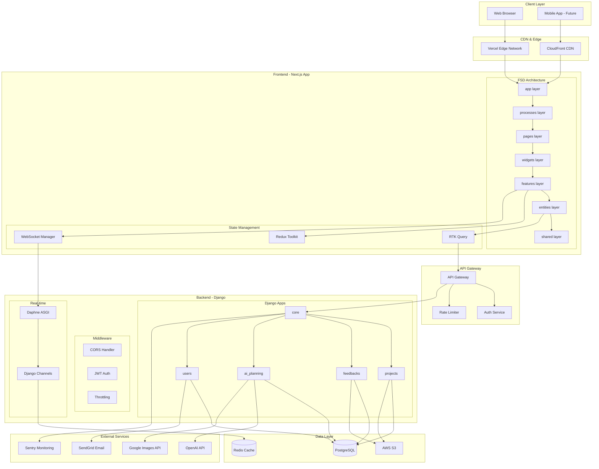
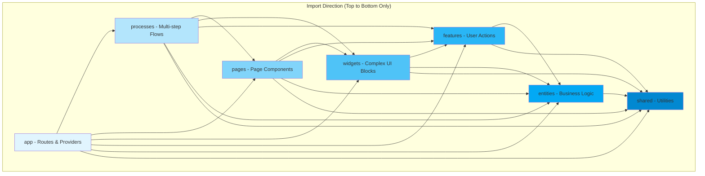
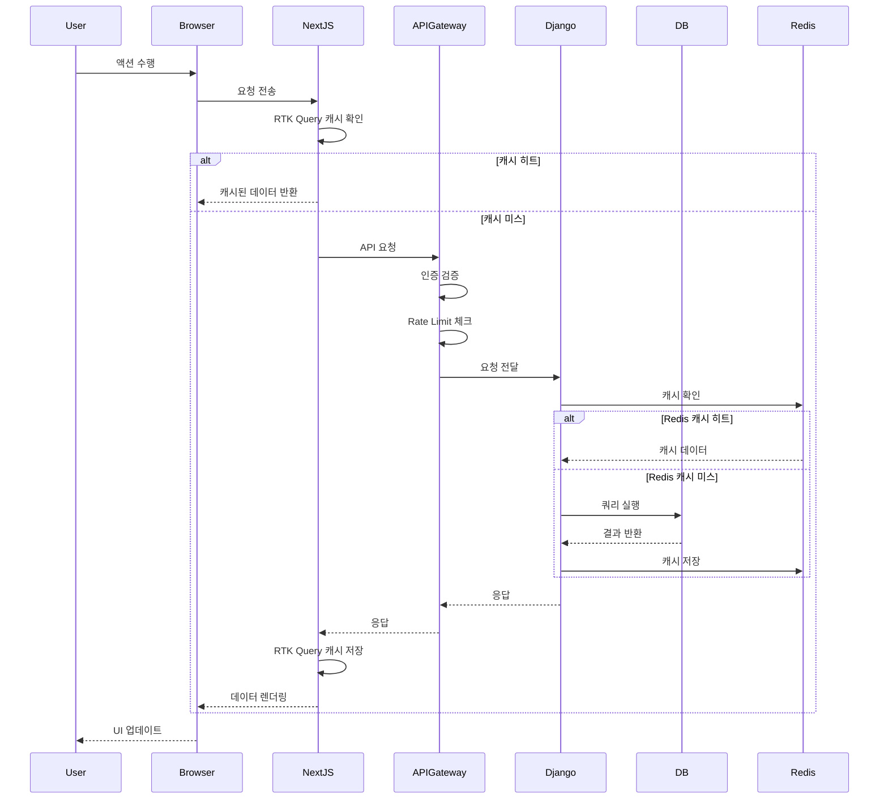
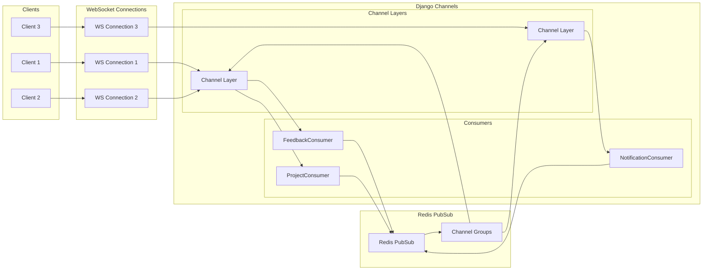
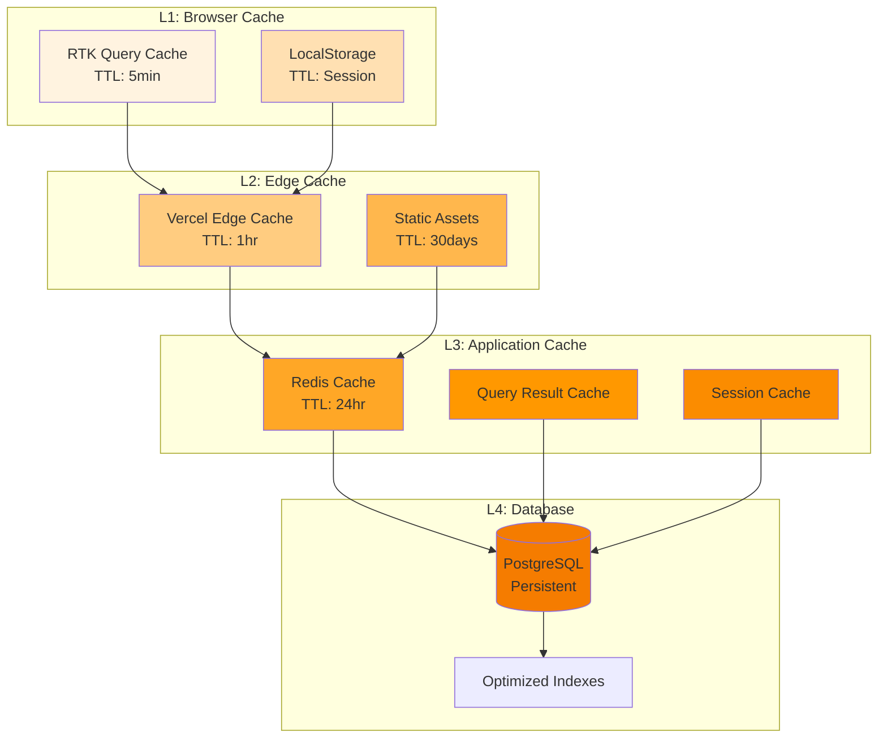
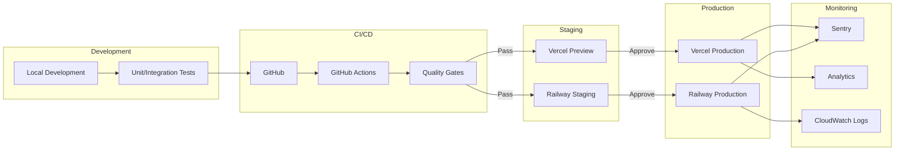
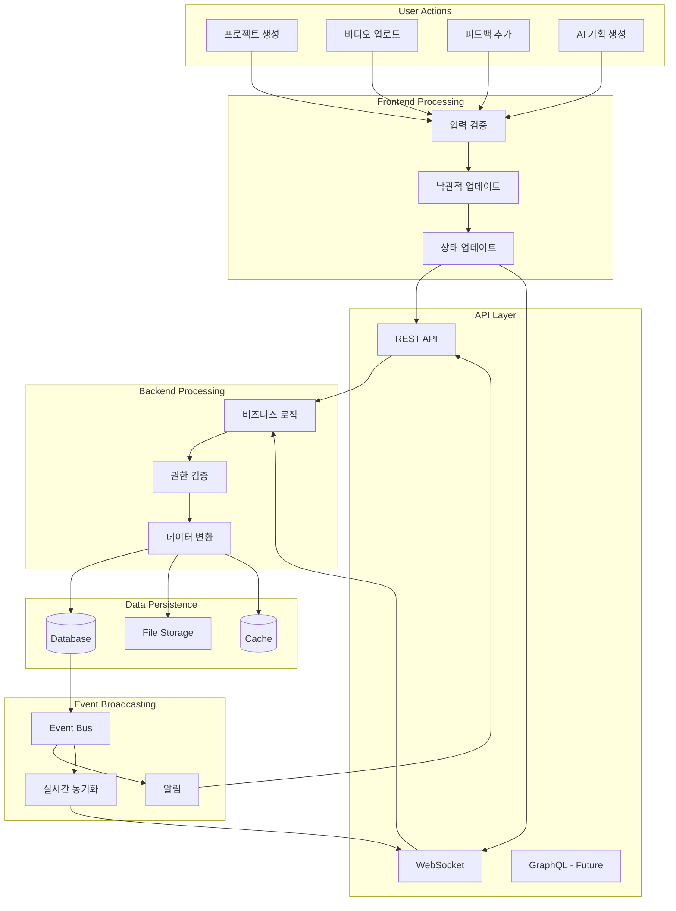
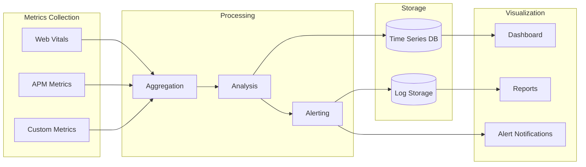

# VideoPlanet 시스템 통합 아키텍처 다이어그램

## 1. 전체 시스템 아키텍처

## 2. FSD 레이어 의존성 다이어그램

## 3. API 통합 플로우

## 4. WebSocket 실시간 통신 아키텍처

## 5. 캐싱 전략 다이어그램

## 6. 배포 파이프라인

## 7. 데이터 플로우 다이어그램

## 8. 보안 아키텍처

```mermaid
graph TB
    subgraph "Security Layers"
        subgraph "Network Security"
            HTTPS[HTTPS/TLS]
            WAF[Web Application Firewall]
            DDoS[DDoS Protection]
        end
        
        subgraph "Application Security"
            CORS[CORS Policy]
            CSP[Content Security Policy]
            XSS[XSS Protection]
            CSRF[CSRF Protection]
        end
        
        subgraph "Authentication & Authorization"
            JWT[JWT Tokens]
            OAuth[OAuth 2.0 - Future]
            RBAC[Role-Based Access Control]
            MFA[Multi-Factor Auth - Future]
        end
        
        subgraph "Data Security"
            Encryption[Encryption at Rest]
            Transit[Encryption in Transit]
            PII[PII Protection]
            Audit[Audit Logging]
        end
    end
    
    HTTPS --> WAF
    WAF --> DDoS
    DDoS --> CORS
    CORS --> CSP
    CSP --> XSS
    XSS --> CSRF
    CSRF --> JWT
    JWT --> OAuth
    OAuth --> RBAC
    RBAC --> MFA
    MFA --> Encryption
    Encryption --> Transit
    Transit --> PII
    PII --> Audit
```

## 9. 성능 모니터링 아키텍처

## 주요 통합 포인트

### 1. Frontend ↔ Backend
- **REST API**: `/api/v1/*` 엔드포인트
- **WebSocket**: `/ws/*` 실시간 채널
- **파일 업로드**: Multipart form-data

### 2. 캐싱 계층
- **브라우저**: RTK Query (5분)
- **CDN**: Vercel Edge (1시간)
- **Redis**: Application Cache (24시간)
- **Database**: Persistent Storage

### 3. 인증 플로우
- **JWT 토큰**: Access (7일) / Refresh (28일)
- **세션 관리**: Redis 기반
- **권한 체크**: RBAC 모델

### 4. 실시간 동기화
- **WebSocket 채널**: 프로젝트별 구독
- **이벤트 브로드캐스팅**: Redis PubSub
- **상태 일관성**: Optimistic UI + Server Reconciliation

### 5. 에러 처리
- **Frontend**: Error Boundary + Toast
- **Backend**: Custom Exception Classes
- **모니터링**: Sentry Integration
- **로깅**: Structured Logging

## 구현 우선순위

1. **Phase 1**: API Gateway 구현
2. **Phase 2**: WebSocket Manager 개발
3. **Phase 3**: 캐싱 전략 구현
4. **Phase 4**: 모니터링 설정
5. **Phase 5**: 보안 강화

이 아키텍처는 확장 가능하고 유지보수가 용이한 시스템을 구축하기 위한 청사진입니다.