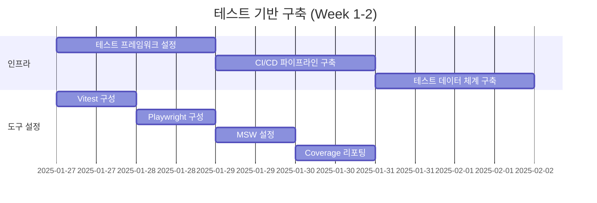
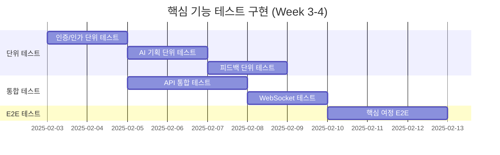

# 테스트 실행 계획
## VideoPlanet 단계별 품질 검증 실행 가이드

---

## 📅 실행 타임라인

### Week 1-2: 기반 구축


### Week 3-4: 핵심 기능 테스트


---

## 🚀 즉시 실행 체크리스트

### Day 1: 환경 설정
```bash
# 1. 테스트 의존성 설치
npm install -D vitest @testing-library/react @testing-library/jest-dom
npm install -D @playwright/test
npm install -D msw @mswjs/data
npm install -D @vitest/coverage-v8

# 2. 테스트 설정 파일 생성
touch vitest.config.ts
touch playwright.config.ts
mkdir -p src/test/setup
touch src/test/setup/setup.ts

# 3. 테스트 스크립트 추가 (package.json)
{
  "scripts": {
    "test": "vitest",
    "test:ui": "vitest --ui",
    "test:coverage": "vitest --coverage",
    "test:watch": "vitest --watch",
    "test:e2e": "playwright test",
    "test:e2e:ui": "playwright test --ui"
  }
}
```

### Day 2-3: 첫 번째 테스트 작성

#### 단위 테스트 예시
```typescript
// src/features/auth/lib/validation.test.ts
import { describe, it, expect } from 'vitest';
import { validateEmail, validatePassword } from './validation';

describe('Auth Validation', () => {
  describe('validateEmail', () => {
    it('should accept valid email', () => {
      expect(validateEmail('user@example.com')).toBe(true);
    });
    
    it('should reject invalid email', () => {
      expect(validateEmail('invalid-email')).toBe(false);
    });
  });
  
  describe('validatePassword', () => {
    it('should require minimum 8 characters', () => {
      expect(validatePassword('short')).toBe(false);
      expect(validatePassword('ValidPass123!')).toBe(true);
    });
  });
});
```

#### E2E 테스트 예시
```typescript
// test/e2e/auth.spec.ts
import { test, expect } from '@playwright/test';

test('user can login', async ({ page }) => {
  await page.goto('/login');
  
  await page.fill('[name="email"]', 'test@example.com');
  await page.fill('[name="password"]', 'TestPass123!');
  await page.click('button[type="submit"]');
  
  await expect(page).toHaveURL('/dashboard');
  await expect(page.locator('.user-name')).toContainText('Test User');
});
```

---

## 📊 일일 실행 스케줄

### 개발 중 (Local)
| 시간 | 액션 | 명령어 | 예상 시간 |
|------|------|--------|----------|
| **코드 작성 중** | Watch 모드 실행 | `npm run test:watch` | 지속 |
| **커밋 전** | 관련 테스트 실행 | `npm test -- related` | 5초 |
| **PR 생성 전** | 전체 테스트 | `npm test && npm run test:e2e` | 5분 |

### CI/CD Pipeline
| 단계 | 테스트 유형 | 트리거 | 시간 제한 |
|------|------------|--------|----------|
| **Pre-commit** | Lint + Unit | 모든 커밋 | 30초 |
| **PR Check** | Unit + Integration | PR 열기/업데이트 | 5분 |
| **Pre-merge** | Full Suite | 머지 전 | 15분 |
| **Post-deploy** | Smoke + E2E | 배포 후 | 10분 |

### 정기 실행
| 주기 | 테스트 | 시간 | 목적 |
|------|--------|------|------|
| **매일 02:00** | Full E2E | 30분 | 회귀 테스트 |
| **매주 월요일** | Performance | 1시간 | 성능 기준선 |
| **매월 1일** | Security Scan | 2시간 | 보안 취약점 |

---

## 🎯 우선순위별 실행 계획

### P0: Critical (즉시 구현)
```bash
# 1. 인증 시스템 테스트
npm run test:auth

# 테스트 대상:
- 로그인/로그아웃
- 세션 관리
- 토큰 갱신
- 권한 검증
```

### P1: High (1주 내)
```bash
# 2. AI 기획 생성 테스트
npm run test:ai-planning

# 테스트 대상:
- 입력 검증
- API 호출
- 응답 파싱
- PDF 생성
```

### P2: Medium (2주 내)
```bash
# 3. 비디오 피드백 테스트
npm run test:feedback

# 테스트 대상:
- 타임스탬프 처리
- 실시간 동기화
- 게스트 접근
- 알림 시스템
```

---

## 🔄 테스트 실행 워크플로우

### 1. TDD 개발 사이클
```bash
# Step 1: 실패하는 테스트 작성
npm run test:watch

# Step 2: 최소 구현
# (테스트가 통과할 때까지 코드 작성)

# Step 3: 리팩토링
# (테스트 통과 유지하며 개선)

# Step 4: 커버리지 확인
npm run test:coverage
```

### 2. 버그 수정 프로세스
```bash
# Step 1: 재현 테스트 작성
npm run test -- --grep "bug-reproduction"

# Step 2: 버그 수정
# (테스트 통과할 때까지)

# Step 3: 회귀 테스트
npm run test:regression

# Step 4: E2E 검증
npm run test:e2e -- --grep "fixed-scenario"
```

### 3. 릴리즈 전 체크리스트
```bash
# 1. 전체 단위 테스트
npm run test:unit
# ✅ 통과율: 100%
# ✅ 커버리지: > 80%

# 2. 통합 테스트
npm run test:integration
# ✅ API 통합: 성공
# ✅ DB 연결: 정상

# 3. E2E 테스트
npm run test:e2e
# ✅ 핵심 시나리오: 통과
# ✅ 크로스 브라우저: 호환

# 4. 성능 테스트
npm run test:performance
# ✅ LCP: < 2.5s
# ✅ FID: < 100ms

# 5. 보안 스캔
npm audit
# ✅ Critical: 0
# ✅ High: 0
```

---

## 🛠️ 테스트 환경 관리

### Local Development
```bash
# .env.test
DATABASE_URL=postgresql://localhost/videoplanet_test
REDIS_URL=redis://localhost:6379/1
API_MOCK=true
LOG_LEVEL=error
```

### CI Environment
```yaml
# GitHub Actions 환경 변수
env:
  NODE_ENV: test
  DATABASE_URL: ${{ secrets.TEST_DATABASE_URL }}
  REDIS_URL: ${{ secrets.TEST_REDIS_URL }}
  CI: true
```

### Test Data Management
```typescript
// test/fixtures/seed.ts
export async function seedTestData() {
  await db.user.createMany({
    data: testUsers
  });
  
  await db.project.createMany({
    data: testProjects
  });
  
  await db.feedback.createMany({
    data: testFeedbacks
  });
}

// 테스트 전 실행
beforeAll(async () => {
  await resetDatabase();
  await seedTestData();
});

// 테스트 후 정리
afterAll(async () => {
  await cleanupDatabase();
});
```

---

## 📈 메트릭 추적

### 일일 메트릭
```javascript
// scripts/daily-metrics.js
const metrics = {
  date: new Date().toISOString(),
  tests: {
    total: 523,
    passed: 518,
    failed: 3,
    skipped: 2,
    duration: 145.3 // seconds
  },
  coverage: {
    lines: 82.5,
    branches: 78.3,
    functions: 85.1,
    statements: 81.9
  },
  flakiness: {
    rate: 0.8, // %
    flakyTests: ['test-id-1', 'test-id-2']
  }
};

// 대시보드에 전송
await sendToDatadog(metrics);
```

### 주간 리포트
```markdown
## 주간 테스트 리포트 (Week 4)

### 📊 Summary
- 총 테스트: 523개 (+45 from last week)
- 성공률: 99.0% (↑ 2%)
- 커버리지: 82.5% (↑ 5%)
- 평균 실행 시간: 2분 25초

### ✅ Achievements
- 인증 모듈 100% 커버리지 달성
- E2E 테스트 자동화 완료
- CI 파이프라인 5분 단축

### ⚠️ Issues
- Flaky 테스트 2개 발견
- WebSocket 테스트 간헐적 실패
- Safari 호환성 이슈 1건

### 📋 Next Steps
- Flaky 테스트 수정
- 성능 테스트 베이스라인 설정
- 보안 스캔 자동화
```

---

## 🚨 트러블슈팅 가이드

### 일반적인 문제 해결

#### 1. 테스트 타임아웃
```typescript
// 문제: 테스트가 5초 후 타임아웃
test('slow async operation', async () => {
  // 해결: 타임아웃 증가
  await expect(slowOperation()).resolves.toBe(true);
}, 10000); // 10초로 증가
```

#### 2. Flaky 테스트
```typescript
// 문제: 간헐적 실패
test('unreliable test', async () => {
  // 해결: 명시적 대기 추가
  await page.waitForSelector('.element', { state: 'visible' });
  await page.click('.element');
});
```

#### 3. 데이터베이스 충돌
```typescript
// 문제: 테스트 간 데이터 충돌
beforeEach(async () => {
  // 해결: 각 테스트마다 격리
  await db.transaction(async (tx) => {
    // 테스트 실행
    await tx.rollback(); // 자동 롤백
  });
});
```

---

## 🎓 팀 교육 계획

### Week 1: 테스트 기초
- TDD 개념 및 실습
- 단위 테스트 작성법
- 테스트 더블 (Mock, Stub, Spy)

### Week 2: 통합 테스트
- API 테스트
- 데이터베이스 테스트
- MSW 활용법

### Week 3: E2E 테스트
- Playwright 기초
- Page Object Pattern
- 시나리오 작성법

### Week 4: 고급 주제
- 성능 테스트
- 보안 테스트
- CI/CD 통합

---

## 📝 체크리스트

### 일일 체크리스트
- [ ] 새 기능에 테스트 작성
- [ ] 테스트 실행 및 통과 확인
- [ ] 커버리지 확인 (목표: 80%)
- [ ] PR에 테스트 결과 첨부

### 주간 체크리스트
- [ ] Flaky 테스트 점검
- [ ] 테스트 실행 시간 분석
- [ ] 커버리지 트렌드 확인
- [ ] 테스트 리팩토링 필요성 검토

### 릴리즈 체크리스트
- [ ] 전체 테스트 스위트 실행
- [ ] 성능 기준 충족 확인
- [ ] 보안 스캔 통과
- [ ] 회귀 테스트 완료
- [ ] 승인자 사인오프

---

**문서 버전**: 1.0  
**작성자**: Grace (QA Lead)  
**최종 수정일**: 2025-08-23  
**다음 리뷰**: 2025-08-30