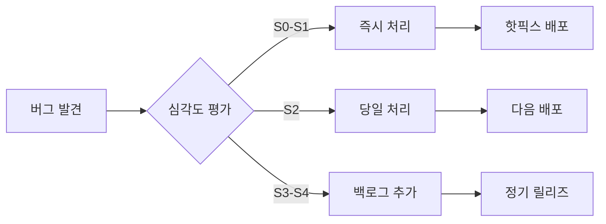

# VideoPlanet 테스트 전략 문서 v1.0
## QA Lead: Grace | 작성일: 2025-08-23

---

## 📋 목차

1. [현황 분석](#1-현황-분석)
2. [테스트 전략](#2-테스트-전략)
3. [테스트 피라미드 설계](#3-테스트-피라미드-설계)
4. [테스트 케이스 매트릭스](#4-테스트-케이스-매트릭스)
5. [CI/CD 품질 게이트](#5-cicd-품질-게이트)
6. [테스트 실행 계획](#6-테스트-실행-계획)
7. [버그 우선순위 매트릭스](#7-버그-우선순위-매트릭스)
8. [리스크 기반 테스팅](#8-리스크-기반-테스팅)
9. [성능 검증 기준](#9-성능-검증-기준)
10. [보안 테스트 체크리스트](#10-보안-테스트-체크리스트)

---

## 1. 현황 분석

### 1.1 현재 테스트 상태
| 항목 | 현재 상태 | 목표 상태 | Gap |
|------|----------|----------|-----|
| **테스트 성공률** | 71% | 95% | -24% |
| **단위 테스트 커버리지** | 미확인 (2개 파일만 존재) | 80% | -80% |
| **통합 테스트** | 부재 | 20% | -20% |
| **E2E 테스트** | 수동 테스트만 존재 | 자동화 완료 | 100% 수동 |
| **성능 테스트** | 기본 설정만 존재 | 자동화 및 CI 통합 | 미구현 |
| **보안 테스트** | 기본 헤더 체크만 | OWASP Top 10 커버 | 미구현 |

### 1.2 테스트 인프라 현황
- **단위 테스트**: Vitest 설정 완료, 테스트 파일 부족
- **E2E 테스트**: Playwright 설정 완료, 실제 테스트 미구현
- **성능 테스트**: Lighthouse CI, K6, Autocannon 설정됨
- **수동 테스트**: manual-journey-test.js 존재

### 1.3 주요 이슈
1. **테스트 커버리지 부족**: 핵심 비즈니스 로직 테스트 부재
2. **E2E 자동화 부재**: 수동 테스트 의존도 높음
3. **성능 기준 미정의**: 명확한 성능 목표치 부재
4. **보안 검증 미흡**: 기본적인 보안 테스트만 존재

---

## 2. 테스트 전략

### 2.1 테스트 철학
> "품질은 검사가 아닌 설계 단계부터 내재되어야 한다"

- **Fail-First Policy**: 모든 기능은 실패하는 테스트부터 작성
- **Incremental Verification**: 각 기능 슬라이스마다 즉시 검증
- **Risk-Based Testing**: 비즈니스 임팩트 기반 우선순위
- **Continuous Quality**: CI/CD 파이프라인에 품질 게이트 통합

### 2.2 테스트 레벨 정의

#### L1: 단위 테스트 (Unit Tests)
- **범위**: 개별 함수, 컴포넌트, 모듈
- **목표 커버리지**: 80%
- **실행 시간**: < 5초
- **도구**: Vitest, React Testing Library

#### L2: 통합 테스트 (Integration Tests)
- **범위**: API 연동, 컴포넌트 상호작용, 서비스 통합
- **목표 커버리지**: 60%
- **실행 시간**: < 30초
- **도구**: Vitest, MSW (Mock Service Worker)

#### L3: E2E 테스트 (End-to-End Tests)
- **범위**: 핵심 사용자 여정, 크리티컬 패스
- **목표 커버리지**: 핵심 시나리오 100%
- **실행 시간**: < 5분
- **도구**: Playwright

#### L4: 성능 테스트 (Performance Tests)
- **범위**: 페이지 로딩, API 응답, 리소스 사용량
- **목표**: Core Web Vitals 충족
- **도구**: Lighthouse CI, K6

---

## 3. 테스트 피라미드 설계

```
         /\
        /E2E\       10% - 핵심 사용자 여정
       /______\
      /        \
     /Integration\   20% - API/서비스 통합
    /______________\
   /                \
  /   Unit Tests     \ 70% - 함수/컴포넌트 로직
 /____________________\
```

### 3.1 레벨별 테스트 분포

| 테스트 레벨 | 비율 | 개수 (예상) | 실행 빈도 | 피드백 속도 |
|------------|------|------------|-----------|-------------|
| 단위 테스트 | 70% | ~500개 | 매 커밋 | 즉시 (<5초) |
| 통합 테스트 | 20% | ~150개 | 매 PR | 빠름 (<30초) |
| E2E 테스트 | 10% | ~50개 | 매 병합 | 보통 (<5분) |

---

## 4. 테스트 케이스 매트릭스

### 4.1 핵심 기능별 테스트 커버리지

| 기능 영역 | 단위 테스트 | 통합 테스트 | E2E 테스트 | 우선순위 |
|----------|------------|------------|-----------|----------|
| **인증/인가** | ✅ 필수 | ✅ 필수 | ✅ 필수 | P0 (Critical) |
| **AI 기획 생성** | ✅ 필수 | ✅ 필수 | ✅ 필수 | P0 (Critical) |
| **비디오 피드백** | ✅ 필수 | ✅ 필수 | ✅ 필수 | P0 (Critical) |
| **게스트 피드백** | ✅ 필수 | ✅ 필수 | ✅ 필수 | P0 (Critical) |
| **프로젝트 관리** | ✅ 필수 | ✅ 필수 | ⚡ 선택 | P1 (High) |
| **대시보드** | ✅ 필수 | ⚡ 선택 | ⚡ 선택 | P2 (Medium) |
| **간트 차트** | ✅ 필수 | ⚡ 선택 | ❌ 불필요 | P3 (Low) |

### 4.2 상세 테스트 케이스 (핵심 기능)

#### 4.2.1 게스트 피드백 제출
```typescript
// 단위 테스트
- validateGuestEmail() - 이메일 형식 검증
- sanitizeFeedbackContent() - XSS 방지
- calculateTimestamp() - 타임스탬프 계산
- formatFeedbackData() - 데이터 포맷팅

// 통합 테스트
- submitGuestFeedback() - API 호출 및 응답
- saveFeedbackToDB() - 데이터베이스 저장
- sendNotification() - 알림 발송

// E2E 테스트
- "게스트가 공유 링크로 접근하여 피드백 제출"
- "타임스탬프 기반 피드백 작성"
- "스크린샷 첨부 피드백"
```

#### 4.2.2 AI 기획 생성
```typescript
// 단위 테스트
- validatePlanningInput() - 입력값 검증
- generatePrompt() - 프롬프트 생성
- parseAIResponse() - AI 응답 파싱
- formatPlanDocument() - 문서 포맷팅

// 통합 테스트
- callAIAPI() - AI API 호출
- savePlanningData() - 기획서 저장
- generatePDF() - PDF 생성

// E2E 테스트
- "영상 기획자가 AI 기획서 생성 및 편집"
- "4단계 스토리 구조 검증"
- "12개 숏트 분해 확인"
```

---

## 5. CI/CD 품질 게이트

### 5.1 Pull Request 품질 게이트

```yaml
PR Quality Gates:
  - 단위 테스트 통과율: 100%
  - 코드 커버리지: >= 80%
  - 린트 에러: 0
  - TypeScript 컴파일: 성공
  - 보안 스캔: 치명적 이슈 0
  - 성능 회귀: 없음
```

### 5.2 배포 파이프라인 품질 체크포인트

| 단계 | 검증 항목 | 통과 기준 | 실패 시 액션 |
|------|----------|----------|-------------|
| **1. Pre-commit** | 린트, 포맷팅 | 에러 0 | 커밋 차단 |
| **2. CI Build** | 컴파일, 단위 테스트 | 100% 통과 | PR 차단 |
| **3. Integration** | 통합 테스트 | 95% 통과 | 수동 리뷰 필요 |
| **4. E2E Test** | 핵심 시나리오 | 100% 통과 | 배포 차단 |
| **5. Performance** | Core Web Vitals | 기준치 충족 | 경고 발생 |
| **6. Security** | OWASP 스캔 | High 이슈 0 | 배포 차단 |
| **7. Staging** | Smoke 테스트 | 100% 통과 | 롤백 준비 |
| **8. Production** | Health Check | 모든 엔드포인트 정상 | 자동 롤백 |

### 5.3 자동화 설정 예시

```javascript
// .github/workflows/quality-gate.yml
name: Quality Gate

on: [push, pull_request]

jobs:
  quality-checks:
    runs-on: ubuntu-latest
    
    steps:
      - name: Checkout
        uses: actions/checkout@v3
      
      - name: Setup Node.js
        uses: actions/setup-node@v3
        with:
          node-version: '20'
      
      - name: Install dependencies
        run: npm ci
      
      - name: Run linter
        run: npm run lint
        
      - name: Type check
        run: npm run type-check
      
      - name: Run unit tests
        run: npm run test:coverage
      
      - name: Check coverage threshold
        run: |
          COVERAGE=$(cat coverage/coverage-summary.json | jq '.total.lines.pct')
          if (( $(echo "$COVERAGE < 80" | bc -l) )); then
            echo "Coverage $COVERAGE% is below threshold 80%"
            exit 1
          fi
      
      - name: Run integration tests
        run: npm run test:integration
      
      - name: Run E2E tests
        run: npm run test:e2e
      
      - name: Performance test
        run: npm run lighthouse:ci
      
      - name: Security scan
        run: npm audit --audit-level=high
```

---

## 6. 테스트 실행 계획

### 6.1 일일 테스트 실행 스케줄

| 시간 | 테스트 유형 | 대상 | 예상 소요 시간 |
|------|------------|------|---------------|
| **매 커밋** | 단위 테스트 | 변경된 모듈 | 5초 |
| **매 PR** | 단위 + 통합 | 전체 | 1분 |
| **매 병합** | 전체 테스트 | 전체 | 10분 |
| **매일 02:00** | E2E 전체 | Production | 30분 |
| **매주 월요일** | 성능 테스트 | Production | 1시간 |
| **매월 1일** | 보안 스캔 | 전체 코드베이스 | 2시간 |

### 6.2 테스트 환경 매트릭스

| 환경 | 용도 | 데이터 | 접근 권한 |
|------|------|--------|----------|
| **Local** | 개발자 테스트 | Mock 데이터 | 개발자 |
| **CI** | 자동화 테스트 | 테스트 데이터 | 시스템 |
| **Staging** | 통합 테스트 | 프로덕션 유사 | QA + 개발 |
| **Production** | 모니터링 | 실제 데이터 | 제한적 |

### 6.3 브라우저 호환성 테스트

| 브라우저 | 버전 | 데스크톱 | 모바일 | 우선순위 |
|----------|------|---------|--------|----------|
| Chrome | Latest-2 | ✅ | ✅ | P0 |
| Safari | Latest-1 | ✅ | ✅ | P0 |
| Firefox | Latest-1 | ✅ | ❌ | P1 |
| Edge | Latest | ✅ | ❌ | P2 |

---

## 7. 버그 우선순위 매트릭스

### 7.1 심각도 (Severity) 레벨

| 레벨 | 설명 | 예시 | SLA |
|------|------|------|-----|
| **S0 - Blocker** | 서비스 전체 다운 | 로그인 불가, 데이터 손실 | 1시간 내 |
| **S1 - Critical** | 핵심 기능 불가 | 피드백 제출 실패 | 4시간 내 |
| **S2 - Major** | 주요 기능 제한 | 특정 브라우저 오류 | 1일 내 |
| **S3 - Minor** | 사용 가능하나 불편 | UI 깨짐 | 1주 내 |
| **S4 - Trivial** | 미미한 영향 | 오타, 색상 | 다음 릴리즈 |

### 7.2 우선순위 결정 매트릭스

```
우선순위 = 심각도 × 발생빈도 × 영향범위

        영향범위
         High
          ↑
    P0 │ P0 │ P1
    ───┼────┼───
    P0 │ P1 │ P2
    ───┼────┼───
    P1 │ P2 │ P3
          →
      발생빈도 High
```

### 7.3 버그 처리 프로세스



---

## 8. 리스크 기반 테스팅

### 8.1 비즈니스 리스크 평가

| 기능 | 비즈니스 임팩트 | 기술적 복잡도 | 변경 빈도 | 리스크 점수 | 테스트 강도 |
|------|----------------|--------------|-----------|------------|------------|
| **결제 처리** | 10 | 8 | 2 | 160 | 매우 높음 |
| **AI 기획 생성** | 9 | 9 | 7 | 567 | 매우 높음 |
| **비디오 피드백** | 9 | 7 | 8 | 504 | 매우 높음 |
| **인증/인가** | 10 | 6 | 3 | 180 | 높음 |
| **대시보드** | 5 | 4 | 6 | 120 | 중간 |
| **프로필 관리** | 3 | 2 | 2 | 12 | 낮음 |

### 8.2 리스크 완화 전략

| 리스크 유형 | 완화 전략 | 테스트 접근법 |
|------------|----------|-------------|
| **데이터 손실** | 백업 및 복구 테스트 | 재해 복구 시나리오 |
| **보안 침해** | 펜테스트, 코드 스캔 | OWASP Top 10 검증 |
| **성능 저하** | 부하 테스트, 모니터링 | 스트레스 테스트 |
| **호환성 이슈** | 크로스 브라우저 테스트 | 매트릭스 테스트 |
| **API 장애** | 서킷 브레이커, 재시도 | Chaos Engineering |

---

## 9. 성능 검증 기준

### 9.1 Core Web Vitals 목표

| 지표 | 목표 | 경고 | 실패 | 측정 도구 |
|------|------|------|------|----------|
| **LCP** | < 2.5s | < 4.0s | ≥ 4.0s | Lighthouse |
| **FID** | < 100ms | < 300ms | ≥ 300ms | Web Vitals |
| **CLS** | < 0.1 | < 0.25 | ≥ 0.25 | Lighthouse |
| **TTFB** | < 600ms | < 1000ms | ≥ 1000ms | WebPageTest |

### 9.2 API 응답 시간 SLA

| 엔드포인트 유형 | 목표 (p50) | 목표 (p95) | 목표 (p99) |
|----------------|------------|------------|------------|
| **읽기 (GET)** | 50ms | 200ms | 500ms |
| **쓰기 (POST/PUT)** | 100ms | 500ms | 1000ms |
| **파일 업로드** | 500ms | 2000ms | 5000ms |
| **AI 생성** | 2000ms | 5000ms | 10000ms |

### 9.3 부하 테스트 시나리오

```javascript
// K6 부하 테스트 예시
export const options = {
  stages: [
    { duration: '2m', target: 10 },  // Ramp-up
    { duration: '5m', target: 50 },  // Stay at 50 users
    { duration: '2m', target: 100 }, // Spike to 100
    { duration: '5m', target: 100 }, // Stay at 100
    { duration: '2m', target: 0 },   // Ramp-down
  ],
  thresholds: {
    http_req_duration: ['p(95)<500'], // 95% 요청이 500ms 이내
    http_req_failed: ['rate<0.1'],    // 에러율 10% 미만
  },
};
```

---

## 10. 보안 테스트 체크리스트

### 10.1 OWASP Top 10 검증

| 보안 위협 | 테스트 항목 | 자동화 가능 | 도구 |
|----------|------------|------------|------|
| **Injection** | SQL/NoSQL/Command Injection | ✅ | SQLMap, ZAP |
| **Broken Authentication** | 세션 관리, 비밀번호 정책 | ⚡ | Burp Suite |
| **Sensitive Data Exposure** | HTTPS, 암호화 | ✅ | SSL Labs |
| **XML External Entities** | XXE 공격 | ✅ | OWASP ZAP |
| **Broken Access Control** | 권한 검증 | ⚡ | 수동 + 자동 |
| **Security Misconfiguration** | 헤더, CORS | ✅ | Security Headers |
| **XSS** | Reflected/Stored/DOM XSS | ✅ | XSStrike |
| **Insecure Deserialization** | 객체 역직렬화 | ⚡ | 수동 검증 |
| **Components with Vulnerabilities** | 의존성 스캔 | ✅ | npm audit, Snyk |
| **Insufficient Logging** | 로그 모니터링 | ⚡ | ELK Stack |

### 10.2 보안 테스트 체크리스트

```markdown
## 인증/인가
- [ ] 비밀번호 복잡도 정책 (8자 이상, 대소문자, 숫자, 특수문자)
- [ ] 계정 잠금 정책 (5회 실패 시)
- [ ] 세션 타임아웃 (30분)
- [ ] CSRF 토큰 검증
- [ ] JWT 토큰 만료 및 갱신

## 데이터 보호
- [ ] HTTPS 전체 적용
- [ ] 민감 데이터 암호화 (AES-256)
- [ ] PII 마스킹
- [ ] 안전한 쿠키 설정 (Secure, HttpOnly, SameSite)

## 입력 검증
- [ ] XSS 필터링
- [ ] SQL Injection 방지
- [ ] 파일 업로드 검증 (타입, 크기, 내용)
- [ ] Rate Limiting

## 보안 헤더
- [ ] Content-Security-Policy
- [ ] X-Frame-Options
- [ ] X-Content-Type-Options
- [ ] Strict-Transport-Security
```

---

## 11. 테스트 자동화 로드맵

### Phase 1: 기반 구축 (Week 1-2)
- [ ] 단위 테스트 프레임워크 설정 완료
- [ ] 테스트 데이터 관리 체계 구축
- [ ] CI/CD 파이프라인 품질 게이트 설정
- [ ] 테스트 커버리지 리포팅 설정

### Phase 2: 핵심 기능 테스트 (Week 3-4)
- [ ] 인증/인가 단위 테스트 작성
- [ ] AI 기획 생성 통합 테스트 작성
- [ ] 비디오 피드백 E2E 테스트 작성
- [ ] 게스트 피드백 전체 레벨 테스트

### Phase 3: 확장 및 최적화 (Week 5-6)
- [ ] 성능 테스트 자동화
- [ ] 보안 스캔 통합
- [ ] 크로스 브라우저 테스트 매트릭스
- [ ] 모니터링 및 알림 설정

### Phase 4: 지속적 개선 (Ongoing)
- [ ] 테스트 실행 시간 최적화
- [ ] Flaky 테스트 제거
- [ ] 테스트 유지보수성 개선
- [ ] 품질 메트릭 대시보드 구축

---

## 12. 품질 메트릭 및 KPI

### 12.1 추적 메트릭

| 메트릭 | 현재 | 목표 | 측정 주기 |
|--------|------|------|----------|
| **테스트 커버리지** | 미측정 | 80% | 매 커밋 |
| **테스트 성공률** | 71% | 95% | 매 빌드 |
| **Escaped Defect Rate** | 미측정 | < 5% | 매 릴리즈 |
| **MTTR (평균 수정 시간)** | 미측정 | < 4시간 | 매주 |
| **테스트 실행 시간** | 미측정 | < 10분 | 매 빌드 |
| **Flaky Test Rate** | 미측정 | < 1% | 매일 |

### 12.2 품질 대시보드 구성

```javascript
// 품질 메트릭 수집 예시
const qualityMetrics = {
  coverage: {
    lines: 82.5,
    branches: 78.3,
    functions: 85.1,
    statements: 81.9
  },
  testResults: {
    passed: 487,
    failed: 3,
    skipped: 10,
    flaky: 2
  },
  performance: {
    lcp: 2.1,
    fid: 85,
    cls: 0.08,
    ttfb: 450
  },
  security: {
    high: 0,
    medium: 2,
    low: 5,
    info: 12
  }
};
```

---

## 13. 테스트 데이터 관리

### 13.1 테스트 데이터 카테고리

| 카테고리 | 용도 | 관리 방법 | 갱신 주기 |
|----------|------|----------|----------|
| **Mock 데이터** | 단위 테스트 | 코드 내 fixture | 필요시 |
| **Seed 데이터** | 통합 테스트 | DB 스크립트 | 매 테스트 |
| **샘플 데이터** | E2E 테스트 | 테스트 DB | 매일 리셋 |
| **익명화 데이터** | 성능 테스트 | 프로덕션 복제 | 매주 |

### 13.2 테스트 데이터 생성 전략

```typescript
// 테스트 데이터 팩토리 예시
class TestDataFactory {
  static createUser(overrides = {}) {
    return {
      id: faker.datatype.uuid(),
      email: faker.internet.email(),
      name: faker.name.fullName(),
      role: 'user',
      createdAt: new Date(),
      ...overrides
    };
  }
  
  static createProject(overrides = {}) {
    return {
      id: faker.datatype.uuid(),
      title: faker.commerce.productName(),
      description: faker.lorem.paragraph(),
      status: 'active',
      createdBy: this.createUser(),
      ...overrides
    };
  }
}
```

---

## 14. 팀 협업 가이드라인

### 14.1 역할과 책임

| 역할 | 책임 | 권한 |
|------|------|------|
| **개발자** | 단위/통합 테스트 작성 | 테스트 실행 및 수정 |
| **QA Engineer** | E2E 테스트, 테스트 전략 | 품질 게이트 관리 |
| **DevOps** | CI/CD, 테스트 인프라 | 파이프라인 설정 |
| **Product Owner** | 승인 기준 정의 | 릴리즈 승인 |

### 14.2 테스트 리뷰 체크리스트

```markdown
## 테스트 코드 리뷰 체크리스트
- [ ] 테스트가 명확한 시나리오를 설명하는가?
- [ ] 테스트가 독립적으로 실행 가능한가?
- [ ] 적절한 assertion을 사용하는가?
- [ ] 엣지 케이스를 고려했는가?
- [ ] 테스트 데이터가 적절한가?
- [ ] 실행 시간이 적절한가? (<100ms for unit)
- [ ] Flaky하지 않은가?
```

---

## 15. 결론 및 다음 단계

### 15.1 즉시 실행 사항 (This Week)
1. **단위 테스트 작성 시작**: 인증 모듈부터
2. **CI 파이프라인 설정**: GitHub Actions 품질 게이트
3. **테스트 커버리지 측정**: 현재 상태 파악

### 15.2 단기 목표 (1 Month)
1. **핵심 기능 E2E 테스트**: 4대 핵심 여정 자동화
2. **성능 베이스라인 설정**: Core Web Vitals 측정
3. **보안 스캔 통합**: 자동화된 취약점 스캔

### 15.3 장기 목표 (3 Months)
1. **테스트 커버리지 80% 달성**
2. **전체 테스트 자동화 완료**
3. **품질 메트릭 대시보드 운영**
4. **Zero Escaped Defect 달성**

---

## 📚 참고 자료

- [Vitest Documentation](https://vitest.dev/)
- [Playwright Documentation](https://playwright.dev/)
- [Testing Library](https://testing-library.com/)
- [OWASP Testing Guide](https://owasp.org/www-project-web-security-testing-guide/)
- [Google Web Vitals](https://web.dev/vitals/)

---

**문서 버전**: 1.0  
**작성자**: Grace (QA Lead)  
**최종 수정일**: 2025-08-23  
**다음 리뷰일**: 2025-08-30

> "품질은 우연이 아니다. 항상 지적인 노력의 결과다." - John Ruskin