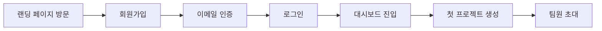
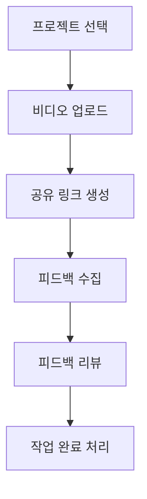

# 🎬 Planet 사용자 여정 시나리오 

## 📋 목차
1. [프로젝트 개요](#프로젝트-개요)
2. [주요 사용자 페르소나](#주요-사용자-페르소나)
3. [핵심 사용자 여정](#핵심-사용자-여정)
4. [세부 시나리오](#세부-시나리오)
5. [기술적 요구사항](#기술적-요구사항)

---

## 프로젝트 개요

**Planet**은 비디오 프로젝트 협업 플랫폼으로, 영상 제작팀이 프로젝트를 관리하고 피드백을 주고받을 수 있는 통합 솔루션입니다.

### 핵심 가치
- 🎯 **효율적인 협업**: 실시간 피드백 시스템
- 📊 **체계적인 관리**: 프로젝트 진행 상황 추적
- 🔒 **보안**: 안전한 인증 시스템
- 🎨 **직관적 UI**: Planet 브랜드 디자인 시스템

---

## 주요 사용자 페르소나

### 1. 프로젝트 매니저 (PM) - 김영희
- **나이**: 35세
- **역할**: 비디오 제작 프로젝트 총괄
- **목표**: 
  - 여러 프로젝트 동시 관리
  - 팀원 피드백 수집 및 정리
  - 클라이언트 커뮤니케이션
- **Pain Points**:
  - 흩어진 피드백 관리의 어려움
  - 프로젝트 진행 상황 파악 지연

### 2. 비디오 에디터 - 이철수  
- **나이**: 28세
- **역할**: 영상 편집 담당
- **목표**:
  - 빠른 피드백 확인 및 반영
  - 타임코드 기반 정확한 수정
- **Pain Points**:
  - 모호한 피드백으로 인한 재작업
  - 버전 관리의 복잡함

### 3. 클라이언트 - 박지민
- **나이**: 42세
- **역할**: 프로젝트 의뢰인
- **목표**:
  - 프로젝트 진행 상황 확인
  - 명확한 피드백 전달
- **Pain Points**:
  - 기술적 장벽
  - 진행 상황 파악의 어려움

---

## 핵심 사용자 여정

### 🎯 Journey 1: 첫 방문부터 프로젝트 생성까지

#### 단계별 상세 시나리오

1. **랜딩 페이지 (0-10초)**
   - Planet 로고와 브랜드 색상(#1631F8)으로 첫인상 형성
   - "영상 협업의 새로운 기준" 메시지 전달
   - CTA 버튼: "무료로 시작하기"

2. **회원가입 (30초-1분)**
   - 간소화된 폼: 이메일, 비밀번호, 이름만 요구
   - 실시간 유효성 검증
   - 이메일 중복 체크

3. **이메일 인증 (1-2분)**
   - 인증 메일 자동 발송
   - 원클릭 인증 링크
   - 인증 완료 후 자동 로그인

4. **대시보드 온보딩 (2-3분)**
   - 환영 메시지와 간단한 튜토리얼
   - 주요 기능 하이라이트
   - 첫 프로젝트 생성 유도

---

### 🎬 Journey 2: 피드백 수집 및 관리

#### 단계별 상세 시나리오

1. **프로젝트 진입 (5초)**
   - 프로젝트 목록에서 선택
   - 진행률 및 최근 활동 표시

2. **비디오 업로드 (30초-2분)**
   - 드래그 앤 드롭 지원
   - 업로드 진행률 표시
   - 자동 썸네일 생성

3. **피드백 수집 (지속적)**
   - 타임코드 기반 코멘트
   - 스크린샷 캡처 기능
   - 우선순위 태깅

4. **피드백 관리**
   - 필터링 및 정렬
   - 상태 변경 (대기/진행중/완료)
   - 팀 토론 스레드

---

## 세부 시나리오

### Scenario A: 긴급 수정 요청 처리

**상황**: 클라이언트가 공개 3시간 전 긴급 수정 요청

1. **알림 수신** (즉시)
   - 푸시 알림: "긴급 피드백이 도착했습니다"
   - 이메일 알림 동시 발송

2. **피드백 확인** (30초)
   - 대시보드 긴급 알림 배너
   - 타임코드 2:34 - "로고 크기 조정 필요"

3. **수정 작업** (10분)
   - 피드백 상태를 "진행중"으로 변경
   - 수정 완료 후 새 버전 업로드

4. **승인 획득** (5분)
   - 클라이언트에게 알림 발송
   - 실시간 프리뷰로 확인
   - 최종 승인 획득

### Scenario B: 팀 협업 피드백 세션

**상황**: 주간 팀 리뷰 미팅

1. **세션 준비** (5분)
   - 프로젝트 피드백 대시보드 오픈
   - 화면 공유 시작

2. **실시간 리뷰** (30분)
   - 동시 시청 및 코멘트
   - 실시간 마킹 도구 사용
   - 액션 아이템 생성

3. **후속 조치** (10분)
   - 피드백 정리 및 할당
   - 마감일 설정
   - 팀원 알림 발송

---

## 기술적 요구사항

### 🔒 인증 시스템
- **VGID 토큰 기반 인증**
  - localStorage와 쿠키 동시 활용
  - 자동 토큰 갱신
  - 세션 타임아웃: 7일

### 🎨 UI/UX 요구사항
- **Planet 디자인 시스템**
  - Primary Color: #1631F8
  - 반응형 디자인 (모바일/태블릿/데스크톱)
  - 다크모드 지원
  - 접근성 WCAG 2.1 AA 준수

### ⚡ 성능 목표
- **페이지 로드**: < 3초
- **API 응답**: < 200ms
- **비디오 스트리밍**: 적응형 비트레이트
- **실시간 동기화**: WebSocket 활용

### 📊 분석 및 모니터링
- **사용자 행동 추적**
  - 페이지 방문 경로
  - 기능 사용 빈도
  - 이탈 지점 분석

- **성능 모니터링**
  - 에러 발생률
  - API 응답 시간
  - 사용자 세션 길이

---

## 📈 성공 지표 (KPIs)

### 사용자 경험
- **온보딩 완료율**: > 80%
- **일일 활성 사용자(DAU)**: 지속적 증가
- **평균 세션 시간**: > 15분
- **피드백 응답 시간**: < 2시간

### 비즈니스
- **월간 활성 프로젝트**: > 100개
- **사용자 유지율**: > 70% (3개월)
- **유료 전환율**: > 15%
- **NPS 점수**: > 50

### 기술
- **시스템 가용성**: 99.9%
- **평균 응답 시간**: < 500ms
- **에러율**: < 1%
- **보안 인시던트**: 0건

---

## 🚀 향후 발전 방향

### Phase 1 (현재)
- ✅ 기본 프로젝트 관리
- ✅ 피드백 시스템
- ✅ 팀 협업 도구

### Phase 2 (3개월)
- AI 기반 자동 편집 제안
- 버전 비교 도구
- 고급 분석 대시보드

### Phase 3 (6개월)
- 플러그인 생태계
- API 공개
- 엔터프라이즈 기능

---

## 📝 결론

Planet은 비디오 제작 팀의 협업 효율성을 극대화하는 플랫폼으로, 직관적인 UI와 강력한 기능을 통해 사용자들의 작업 흐름을 혁신합니다. 

지속적인 사용자 피드백 수집과 데이터 기반 개선을 통해 업계 최고의 비디오 협업 도구로 발전할 것입니다.

---

*최종 업데이트: 2025-08-17*  
*버전: 1.0.0*